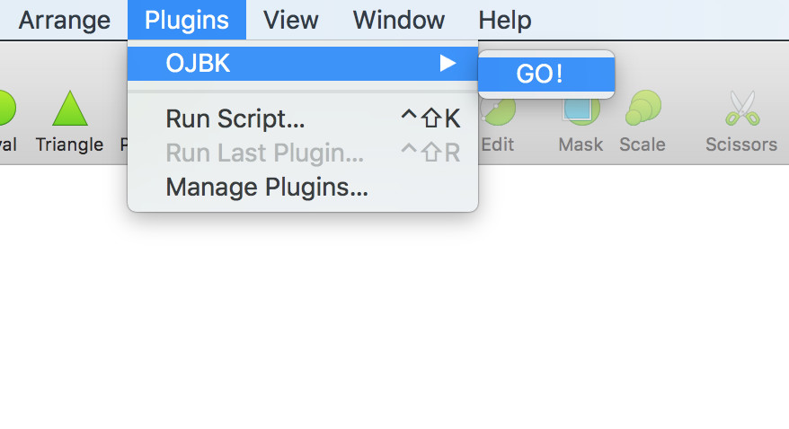
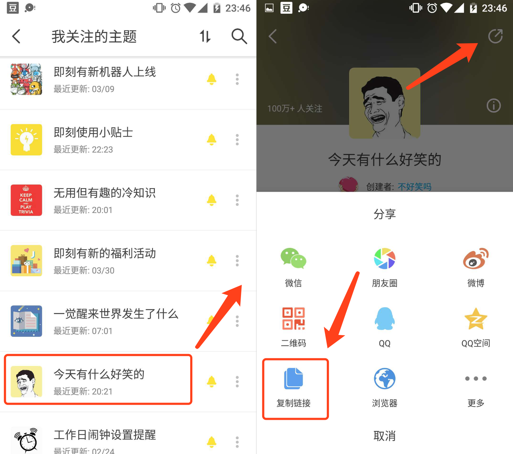

我们每天被微信这款黑洞应用吸去了大量的时间，想要摆脱它却又怎么也摆脱不掉。关朋友圈、取关公众号、退闲聊群，却仍然解决不了问题。其实想要摆脱这款黑洞应用也很简单，我们只需要再找另一款黑洞应用代替它就可以了。

最近有一款黄色的应用就很适合作为另一个黑洞。当然我说的黄色是指它的图标是浅黄色的，但这个黄色的图标下却有着丰富的内涵。对于设计师来说，这是一款能够给你带来灵感，激起你无限创意的应用。

你以为我说的是这个常驻 Dock 栏的黄色大钻石吗？当然不是，我要说的是“每天十分钟，看点好东西”的即刻。即刻会根据你关注的主题，给你推荐各种你想看的信息，比如川普又发推特啦、又有大公司被收购啦等等，让你在工作之余放松一下大脑。

但是，正如文首提到的，这也是一款黑洞应用，上瘾了每天可不止十分钟。所以你上班总是拿着手机在那刷，被老板看见了也不太好。那有没有一种办法可以一边刷即刻，一边又不被老板看出来呢？

那就来试试我刚写的这款 Sketch 插件吧！

你可以在电脑上前往下面的地址下载安装，这个过程我就不多说了。

https://github.com/leadream/jike-sketch-plugin

安装好之后，新建一个 Sketch 空白文档（切记：**不要在你的项目文件里面尝试，不然你的文件可能会被弄乱**），点击顶部菜单栏，依次选择 Plugins -> OJBK -> GO! 就开始运行我们的插件啦。

此时会弹出一个对话框，让你输入一个即刻主题的链接。

现在里面有一个默认的主题链接，这是一个名叫“微信新动向”的主题，我们直接点击 OK。如果没有意外的话，过一两秒之后你的 Sketch 空文档中间会出现一个新的画板，里面就是这个插件在该主题下抓取的最新的几条动态。

为了让你的画板看起来干净利落，我没有把抓取的图片贴上去（其实是不会做），也没有给它添加额外的样式（其实是懒得做）。简直完美，即使老板已经在你身后，你也可以理直气壮地和TA说，“我是一个追求完美的人，所以我要用真实的文本填充设计图”。

你可能会问，假如我想看其他的主题呢？很简单，去即刻 app 中按下图找到相应主题的链接，再次启动该插件并复制链接到对话框中就可以了。

从今天开始，用 Sketch 愉快地刷即刻吧。
