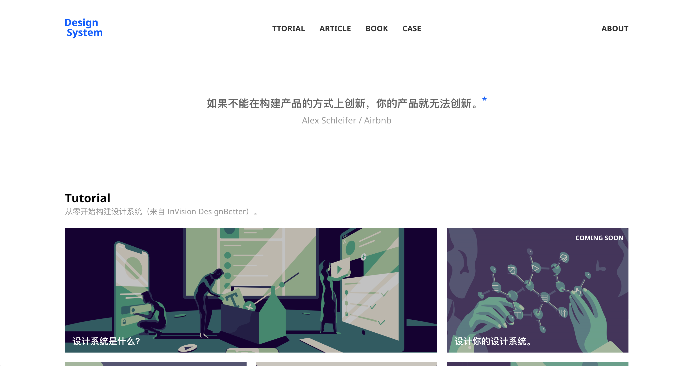

设计系统自诞生以来备受追捧，那么设计系统究竟是什么呢？它又是为了解决什么问题呢？

很多人认为设计系统就是一个可复用的组件库，这是对设计系统最大的误解，组件库只是它的产出物之一。在我看来，设计系统是为了提高设计和开发协作效率而出现的。它不仅仅包含组件库，还包含了设计规范、协作模式以及一系列的自动化工具等等。设计系统的构建者也不仅仅是设计师，团队内所有设计系统的使用者都可以参与其中。

鉴于国内相关的资料不多，我建了这个网站来收集相关的教程、文章、书籍和案例，希望帮助更多人了解并运用设计系统。如果你想要参与其中，可以到 [Github 仓库](https://github.com/leadream/designsystem/issues)提交 issue。