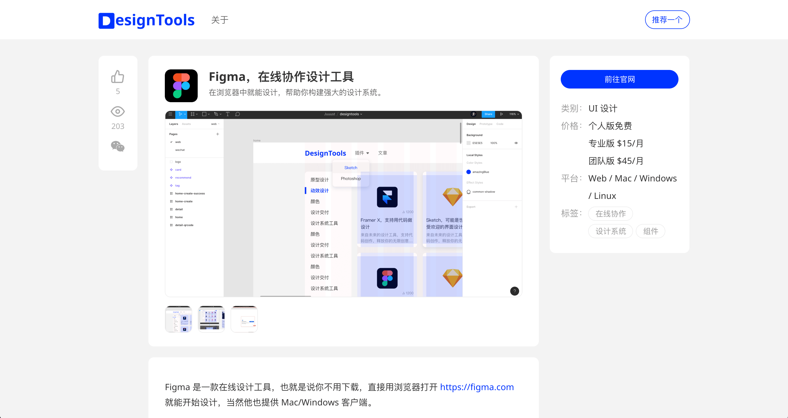
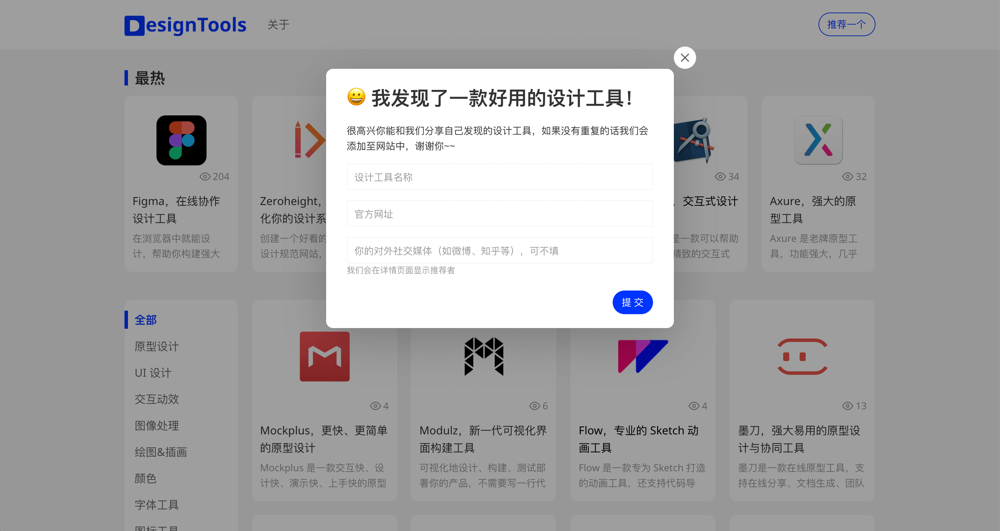

得益于互联网行业的蓬勃发展，这几年设计工具如雨后春笋一般冒出。

随着竞争越来越激烈，产品迭代节奏也越来越快，而一款合适的设计工具能帮助设计师提高效率，把更多的时间专注于用户和业务上。为了能够帮助设计师更快地选择合适的工具，我做了 DesignTools，收集所有设计相关的工具，并详细介绍它们。

如果你愿意的话，还可以和我分享你喜欢的设计工具。

你还可以用手机扫码在小程序上查询设计工具。

我发现很多设计师，尤其是刚入行的设计师，对设计工具存在一定认知误区。结合我的经验，我对设计工具有如下几点建议：

- 没有最好的设计工具，只有最合适的。
- 合适的设计工具能提高你的设计效率，但不一定能提高设计水平。
- 如果它是你的生产力工具，且能支付得起的话，请尽量购买正版。

谢谢阅读，希望能帮到你。