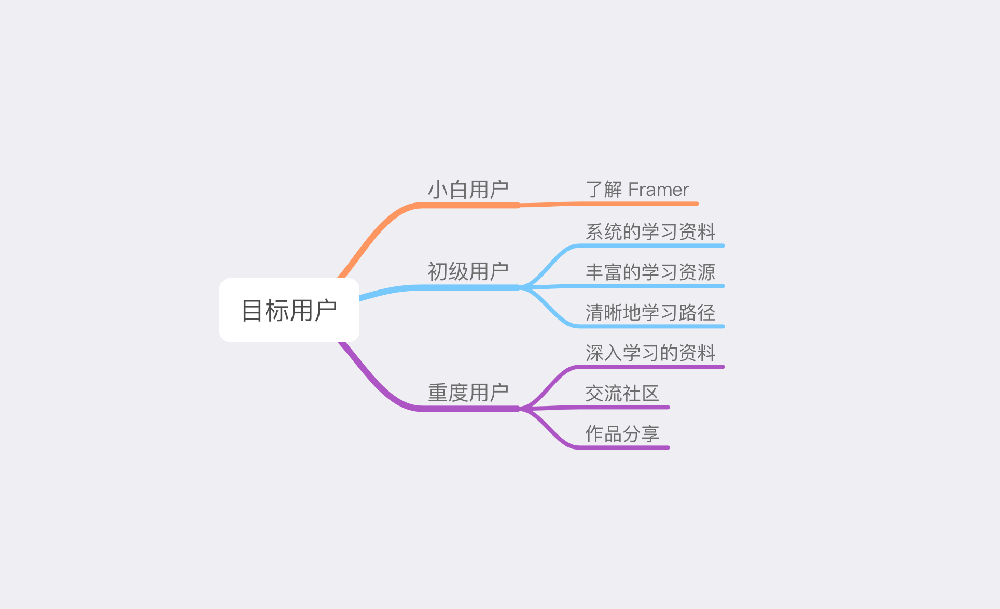
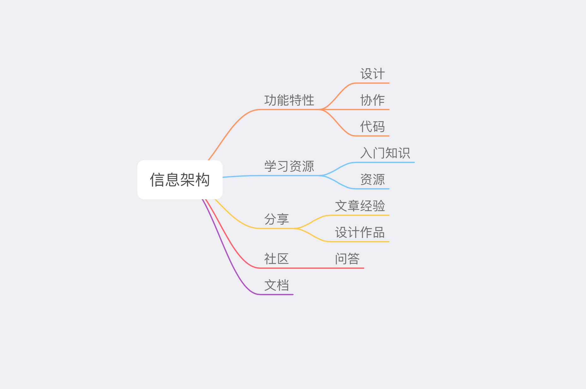
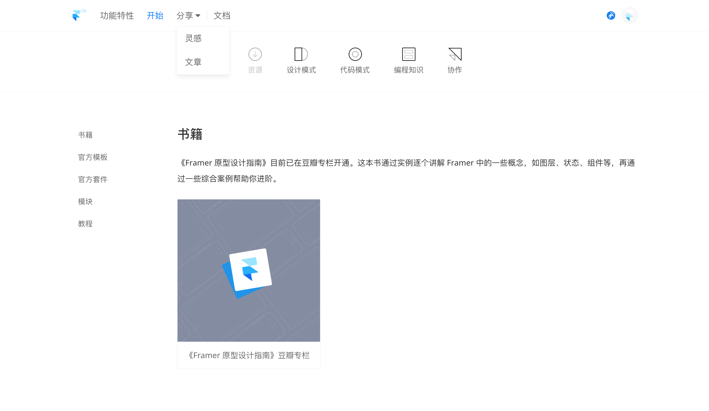
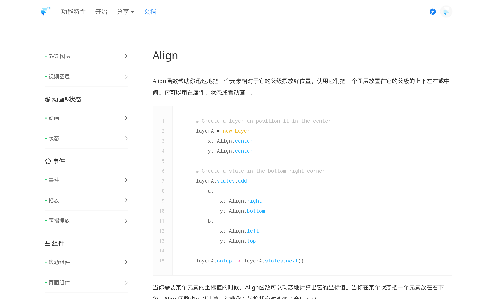

Framer 中文网 2.0 （以下简称 Framercn ）是在 [Framer 中文网第一版](/2016/framer)的基础上演化而来的。第一版做的比较匆忙，没有从用户需求出发，只是我按照自己的思考去做的。2017 年我重新思考并整理了一下用户的需求，开始着手做第二版。

## 背景
2016 年各种原型工具像雨后春笋一般冒出来，像比较出名的 Flinto、Principle 等。相比于这些原型工具，Framer 是比较独特的一个。

Framer 让设计师可以通过写代码来实现高保真原型，虽然其提供了丰富的内置组件，而且也逐渐加入了设计模式，但对于绝大部分设计师来说仍然有很陡峭的学习曲线。由于国内外的设计环境不同，国内很多设计师对于写代码还是有一定的排斥心理，所以 Framer 在国内仍是比较小众的设计工具。

因此如果我只是像第一版那样直接将 Framer 官网的内容翻译过来，很多国内的设计师也不一定了解 Framer 是做什么的，即使了解了也不知道从哪里入手开始。于是，我决定对 Framercn 改版，进行第二版的设计与开发。

## 用户及需求分析
我们有一个 Framer 交流群，大家经常会在里面问问题或者分享作品，通过聊天我了解到了大家对于网站改版的一些需求。这个群里的用户其实有很多种，有一些是已经将 Framer 作为生产力工具的设计师，还有一些是刚刚接触正在学习的设计师，还有一些刚刚知道 Framer 的设计师。对于处于不同阶段的设计师而言，他们的需求也是不一样的。

* **对 Framer 保持观望的小白用户**
>很多刚刚知道 Framer 的设计师一般都会问：用 Framer 写的代码能直接给开发用吗？相比于 Flinto 这些简单易学的工具，Framer 有哪些其他的优势？对于这部分用户，首先应该清晰地告诉他们 Framer 是什么样的设计工具。
* **能够设计简单原型正在学习的初级用户**
>初级用户一般会在群里问一些基础性的代码问题，但是这些问题一般在文档中都能找到答案。他们由于刚开始接触编程，根据入门的资料能够写一些简单的效果，但是在使用过程中会面对各种问题无法解决，也没有系统的学习思路。这部分用户需要的是一些系统的学习资源，一个可以提问的地方，或者是一条比较清晰地学习路径。
* **以 Framer 作为生产力工具的重度用户**
>重度用户已经过了挣扎期，他们能够设计出比较复杂的原型，但是更想去深入地学习，或者分享一些自己的经验和作品。

## 信息架构
基于此，在 Framercn 2.0 中除了要翻译官方的文档以外，我觉得还应该有一部分对 Framer 做详细的介绍，有一个集中的学习资源索引，有一个供大家交流的地方。

* **功能特性介绍**
>Framer 是一种比较新颖的设计工具，结合了代码与设计两种模式，但是对于大多数刚接触的设计师来说可能不太了解该怎样上手，怎样协作，有什么优势。所以我需要用一些篇幅告诉他们 Framer 是什么，对你的设计流程有什么帮助。
* **学习资源**
>国内的学习资源比较匮乏，而且大多很分散，没有成体系。因此，需要有一个地方来集中这些资源，比如官方组件、扩展模块、教程等。官方有一些如何从设计过渡到代码和编程基础知识的介绍，也是很好的入门资源。
* **分享**
>对于很多编程的问题，通过别人作品中的代码去学习解决是最快速的方法，而一些重度用户也希望分享自己的作品。同时，如果我们能够将网上比较散的作品或文章集中在这里，也能够帮助更多用户。
* **问答社区**
>目前国内大部分的 Framer 用户都是通过群内交流来解决问题或进阶的，但是这些内容不能很好地沉淀下来，而这些对于正在学习的设计师确实很宝贵的资源。因此我们需要一个问答社区来沉淀它们，方便后来者学习，也避免了一个问题被问很多遍。
* **文档**
>和其他设计工具不一样的是，Framer 的文档还包括了编程文档，编程文档的内容很多而且很重要，在使用时也会被经常查阅。

## 设计&开发
由于我本身是一个前端开发，因此就简单地按照信息结构层级画了几个草图，就开始边写代码边设计了。目前[网站](http://framercn.com)除了问答社区，其他部分已经完成并上线。

有一些内容比如入门资源和文档是从官方网站中翻译过来的，但是我觉得如果直接按照官方网站那样对国内设计师不太适用，就重新整理了一下信息层级。

比如下图中的入门资源部分，在官网中编程知识那个章节隐藏的很深，但是对于国内来说还是很有必要的，因此我把它放在了很显眼的位置。

在文档这里，官网是按照首字母排序索引的，但我觉得应该按照功能排序，就重新整理了一下。我按照哪些属于布局界面、哪些属于状态动画、哪些属于组件重新分类，方便使用者查阅。

## 后续待完成
目前相比于第一版，Framercn 2.0 更加简洁清晰，功能也丰富了一些，但是由于一些技术或时间原因距离我心中的完美还有很大距离。而在第二版发布之后，我又陆陆续续收到了一些设计师的反馈，我总结了一下，也算是后续的工作计划。

* **站内搜索**
>现在虽然站内资源比较齐全了，文档也基本全部翻译了，但是对于不熟悉网站结构的人来说还是很难快速找到想要的东西。
* **问答社区**
>问答功能是大家要求比较强烈的，但是由于功能比较复杂而且我不想使用第三方社区（想要定制一些功能特性），就一直排期靠后。这是后续工作的重中之重，现在已经着手开发。
* **社区运营**
>到目前为止，Framercn 上的东西大部分都是对外输出的，很少有用户参与的部分。为了保证一个正向循环，在后面一定要引导用户参与进来，创造更多内容。这需要很好地社区运营，但也是我的薄弱项，所以我准备向一些专业的人请教学习。
