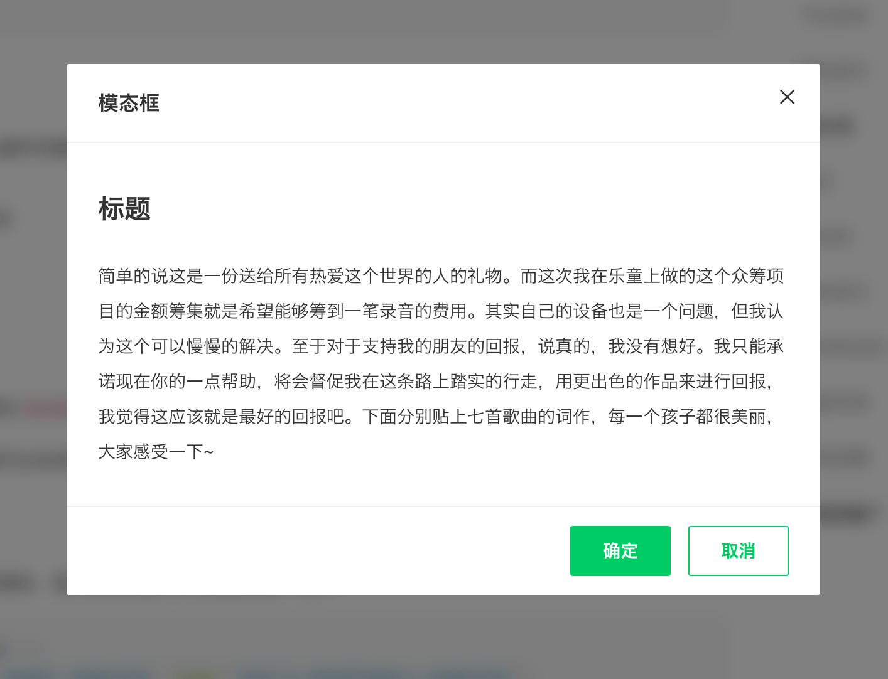
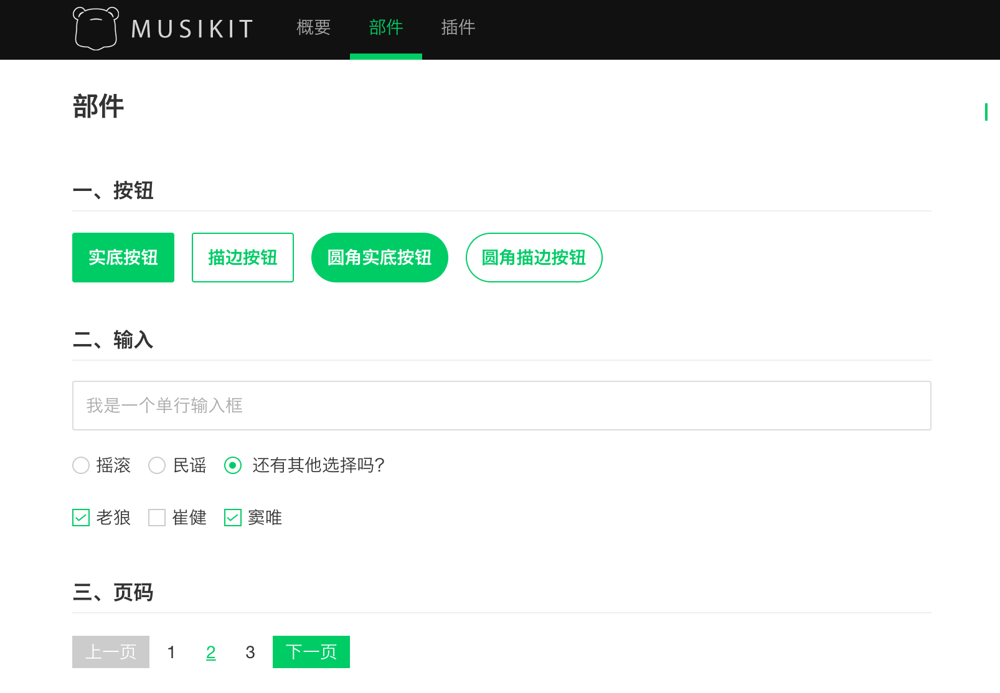
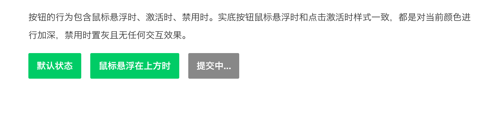
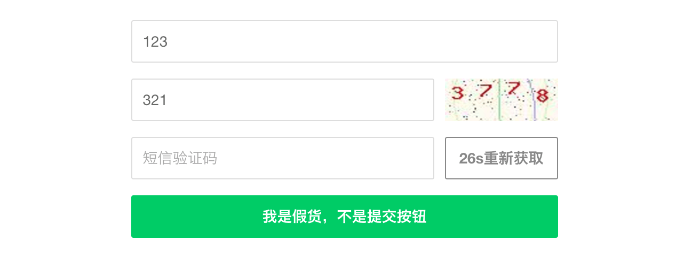
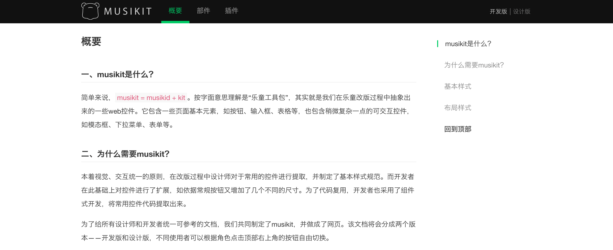

>这是我在第一家公司（乐童音乐）任职前端工程师时推动设计师一起创建设计规范的故事。

这个项目源起于乐童音乐网站改版，而此次改版的前端由我负责。由于之前的前端代码有很多冗余且没有很好地规划，所以我们决定采用组件式开发的方案来重构。我们希望在这一次将网站的公共组件提取出来，形成自己的组件库和文档，而设计师也希望在这一次改版能够形成一套设计规范，因此我就同时推动设计师一起完成了这套设计规范，我们给它命名为 Musikit（因为公司英文为 Musikid）。

通过和设计师的交谈，我发现前端的组件式开发和设计师的设计规范有很多相通之处。我们都会在开发或设计过程中有意识地考虑复用组件，且这些可复用组件也可以在一定程度上进行定制。比如在进行模态框设计时，设计师会考虑它有一个基础样式，而在不同场景下它的标题颜色可以不同；同样地，前端工程师将其封装成组件时会预留自定义标题颜色的接口。

于是我决定发起“乐童音乐网站开发&设计规范制定”项目，让设计师和开发者共同协作制定可用性更高的规范。因为公司英文名为Musikid，我们决定给这套规范起名为Musikit（Musikid Kit）。Musikit的制定过程虽然充满曲折，但每个参与制定的人都有不少收获。整个过程，大概是可以分为三部分。

## 设计先行，开发跟随

产品文档交付之后，设计师会进行整体风格把控，并制定一些基础规范，比如字体使用、字号层级、基本色调等。这些东西完成之后，设计师就会开始具体页面的设计。不考虑特殊页面（专题、活动等），此时必定需要设计诸如按钮、输入框之类的基础控件。这一类我们称其为部件，它们是最基本的页面元素。

当设计进行到一定程度，设计师可以考虑组合部件形成组件，比如将按钮等部件组合成一个模态框组件。但是在此过程中设计师很容易忽略一些东西，而这些东西对于开发来说却是必须考虑的。比如在进行按钮的整理归纳时，设计师考虑了按钮的形状、颜色、大小以适应不同场景，却没有考虑到有些地方为了防止重复提交表单需要在用户点击按钮之后将按钮禁用。这时候就需要开发跟进，对设计师的部件或组件进行补充。

## 设计&开发共同推进

接下来的过程，设计师和前端开发都需要一定的敏感度，在工作过程中注意哪些东西是可以作为部件或组件的。比如我们在登录注册弹出层的设计及开发过程中就注意到了发送短信验证码是可以作为一个组件的，因为不仅在这里需要用到，以后一些需要验证用户身份的场景都会用到。

涉及到组件，尤其是一些复杂组件时，除了需要考虑样式的可定制，还需要考虑交互细节。很多时候交互细节需要设计师开发一起考虑，而且是在设计和开发过程中不断完善的。这就需要设计师和开发定期开会，互相反馈。

## 存档

当然这一部分是跟随整个设计&开发过程的。我们把Musikit和主站放在一起，并对访问做了权限，只能内部访问。Musikit中除了有设计师的使用规范，还包含前端开发的代码示例，我们还做了一个切换按钮用来切换设计和开发的角色用来快速查阅。这样一来，设计师和前端都可以进行参阅，而且这些组件还是可以交互的，清晰明了，简单易懂。

目前来说，Musikit的东西还不是很多，在以后内容丰富之后可能会考虑脱离主站，同时增加博客，鼓励设计师和开发分享一些自己的想法。

## 结语

改版第一阶段完成后，Musikit就上线了。相信有了Musikit在第二阶段的工作过程中大家的效率都会提升，但是这套设计规范远远没有完成。这个过程中，设计师了解了前端开发的一些简单原理，前端开发也能及时了解设计师的想法，大家不再是各做各的而是真正协同起来，这也许是共同制定设计规范的最大收获。
