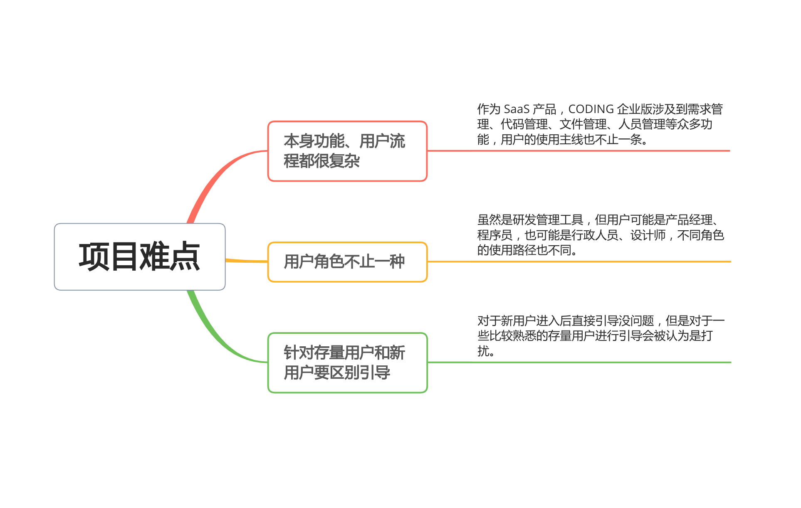

# 背景
我刚入职 CODING 时，CODING 企业版接收到很多用户反馈：**功能太多太复杂，不知道如何使用**。作为 B 端产品，CODING 功能主线不止一条，新用户首次进入不知道从哪开始，老用户不知道如何进行完整的项目协作。为了帮助用户更快熟悉产品，我们决定设计一个用户引导方案，并交由我来负责产品方案设计，并推动上线。

# 难点
CODING 企业版是一个研发管理平台，涉及到需求管理、代码管理等众多功能，因此用户引导会有很多难点。我整理了一下，有如下几条：

- **本身功能、用户流程都很复杂** 
作为 SaaS 产品，CODING 企业版涉及到需求管理、代码管理、文件管理、人员管理等众多功能，用户的使用主线也不止一条。
- **用户角色不止一种** 
虽然是研发管理工具，但用户可能是产品经理、程序员，也可能是行政人员、设计师，不同角色的使用路径也不同。
- **针对存量用户和新用户要区别引导** 
对于新用户进入后直接引导没问题，但是对于一些比较熟悉的存量用户进行引导会被认为是打扰。

# 问题分析
针对以上问题，我通过查阅一些用户反馈和用户数据，做出了如下思考：
