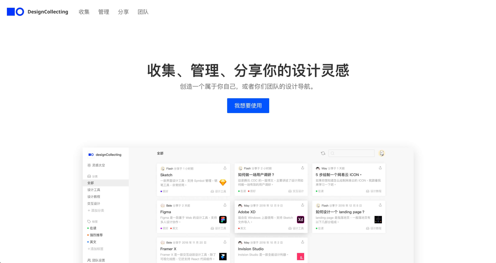
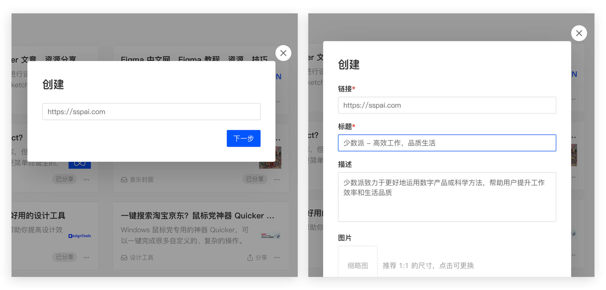
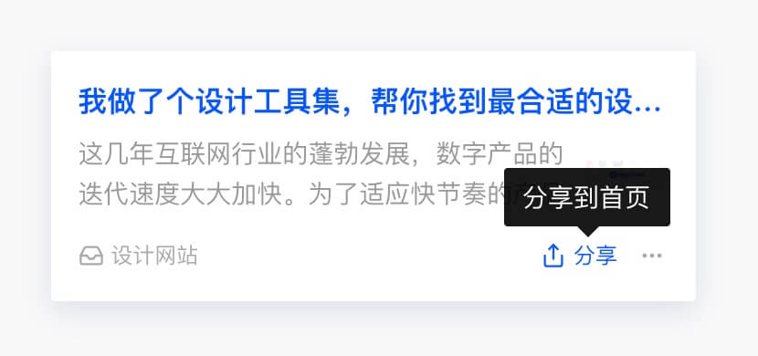

# 想收集设计相关的网址？试试我做的这个网页工具
最初诞生这个想法是在去年。我们设计团队每周都会开一个分享会，大家把自己最近看到的好网站、新玩意儿分享出来，一起获取灵感扩宽视野。

当时我们一起维护了一个 Wiki，会及时把自己分享的内容放到里面。但随着分享内容增多，搜索特定条目就变得困难，不方便查阅。

当时我就产生了一个想法：**如果我们能够有一个集中管理的地方就好了，它有点像几个人一起维护的一个设计导航。**随后几天里我开始构思它的功能，并做了一个设计效果图，但我没有急于马上实现。

## 验证想法
为了验证这个想法的需求量有多大，我做了一个[落地页](https://collecting.design/tutorial)，并放了一个邮箱订阅提醒的按钮，想看看有多少人会对这个产品感兴趣。

当时我在自己的公众号和即刻账号上进行了小范围宣传，随后断断续续收到了九十多个订阅，很多人订阅时还留言给了一些建议请求。这时候我才坚定了要把它实现的想法，不过在后来我又重新思考了一下它的功能。

## 重新思考实现
最开始的想法是把它作为一个团队的工具，但是仔细想了想这样便限制了它的使用场景，只局限在了设计分享会。于是，我把“团队”的定义扩大：**任何人都可以用它收集自己喜欢的网站，也可以把自己的收集分享给所有人**。

最终我把它的主要功能定位在收集、管理和分享设计灵感。首先，每个人都可以收集自己喜欢的设计网站，只需要填写一个链接，就能够自动解析出网站内容，存到自己的收集中。

这样，每个人就都有了一个专属于自己的设计导航，还可以随时增加或更新。

其次，为了方便查找，收集的卡片还可以使用分类管理。这样，就能保证自己收集的设计灵感井井有条。

最后，我们还可以把自己收集的设计灵感分享到首页，这样其他用户打开首页也能看到这张卡片啦。

当我在首页看到了别人分享的设计灵感时，我还可以把它采集到自己的收集中。这样经过分享、采集，就形成了一个正向循环，相当于所有的用户在一起是一个“团队”，我们互相交换设计灵感。

经过半年的打磨，[DesignCollecting](https://collecting.design) 终于上线了。如果你正好有这样的需求，可以去尝试一下。它还不够完美，所以我留了一个反馈入口（登录后左侧菜单中），有任何问题、建议你都可以去那里告诉我。

我希望有更多设计师能够用它收集灵感，也向这个世界分享和交换灵感。