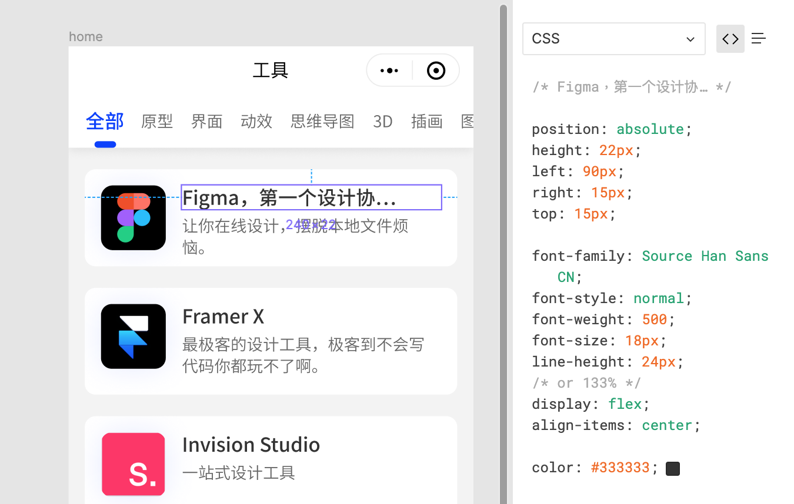
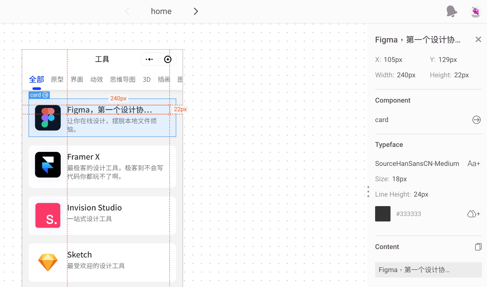
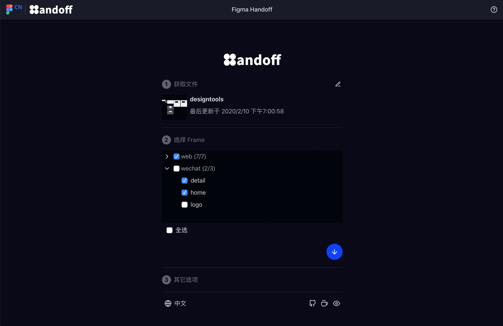
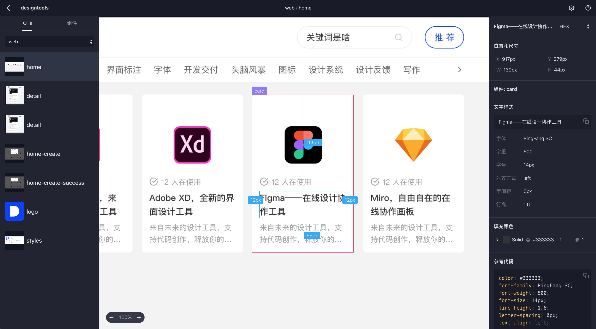
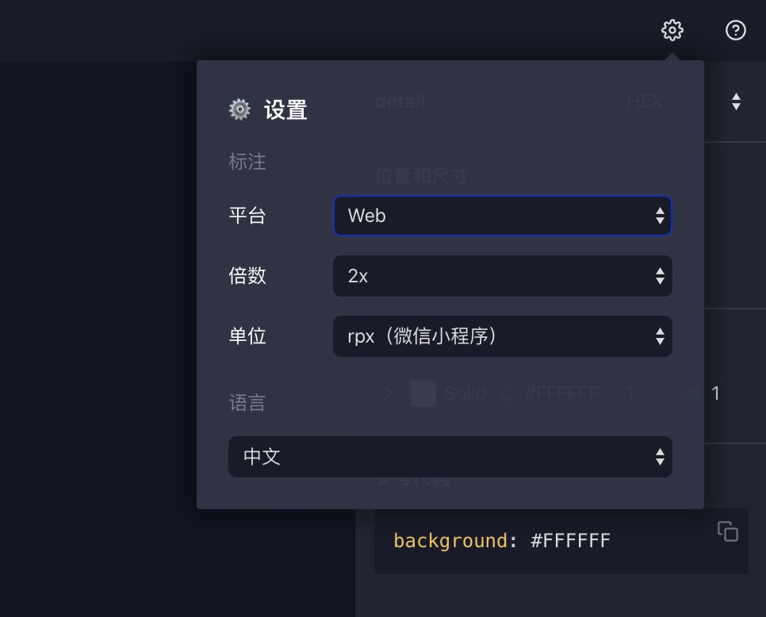
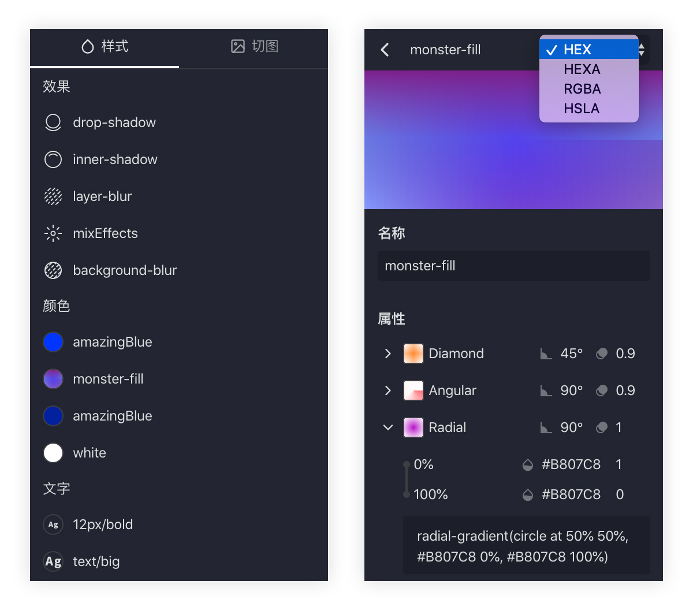
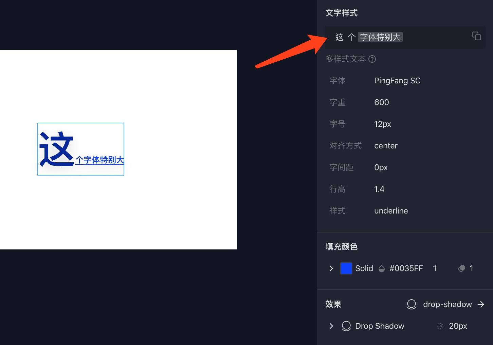
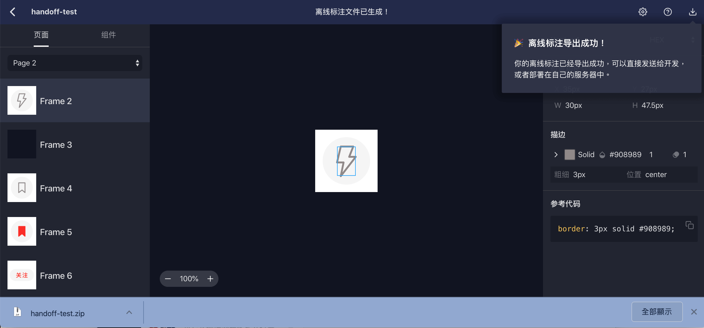
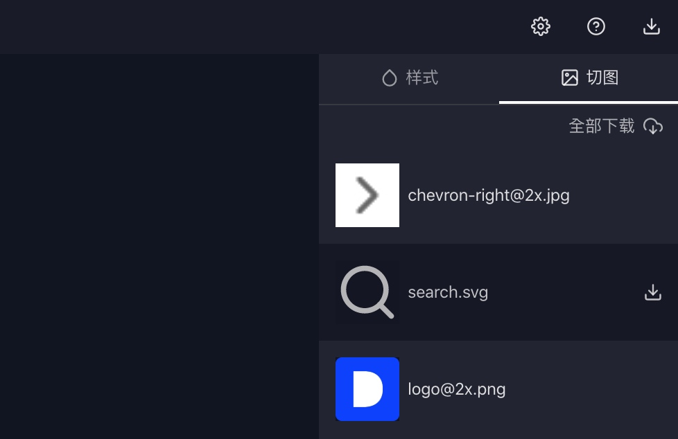

Figma 是一个很棒的设计工具，[我使用的这一年来](https://sspai.com/post/55044)感觉越来越离不开它了。但是，设计从来不是一个人的事，尤其是数字产品的设计。

**我们的设计稿，最终要交付到开发手中，让他们来把设计稿变成最终的产品。**Figma 本身带有交付功能，只需要给开发的账号开通查看权限并发送文件链接就可以了，但是有两个原因导致开发还不太愿意接受 Figma。

首先，Figma 自身的交付功能还不够强大，只有参考代码。之所以说是参考代码，是因为从设计到代码其实并没有唯一解，开发大概率不会直接复制这段代码直接使用。

因此，提供可复制的属性值会是更好的办法，像其他交付工具如 Zeplin、蓝湖都是这么做的。

其次则是 Figma 的访问速度问题，因为服务器在国外所以首次打开会很慢。设计师因为经常使用在本地有缓存或许还能忍受，但如果开发第一次收到这个链接花了好几分钟才打开，是万万不能接受的。

由于这两个原因，加上受到 [Sketch Measure](https://github.com/utom/sketch-measure) 的启发，我决定自己开发一个可以生成离线文件的 Figma 交付工具。它就叫 [Figma handoff](https://figmacn.com/handoff/)，代码已经[开源在 GitHub](https://github.com/leadream/figma-handoff)。

下面，我想从功能的角度介绍一下 Figma handoff。

## 标注
Figma 与其他设计工具最大的不同是基于 Web 的属性，所有设计数据都存储于云端。因此，Figma handoff 是通过 Figma 提供的开放 API 来获取设计数据，来生成设计标注的。

你只需要输入文件链接和 [Access Token](https://www.figma.com/developers/api#access-tokens)，并选择需要生成标注的 Frame，它就可以自动帮你生成标注了。

### 基本信息标注
生成后的标注可以查看 Frame 和组件的尺寸、间距等信息，也可以查看每一个设计元素的各项属性。右侧的属性值都是可以直接点击复制的，方便开发根据自己的代码偏好使用。

### 标注设置
同时，Figma handoff 还提供平台、像素密度、标注倍数和单位等选项，方便开发直接使用而不必换算。**为了适应国内的微信生态，单位中还特别增加了小程序的 `rpx`。**

### 样式标注
除了元素标注，Figma handoff 还会自动抓取当前文件中的样式，并生成对应的样式属性值，这些样式属性可以方便开发统一编写为 design tokens。

### 富文本样式
这里需要特别提一下富文本样式的标注。我们在设计时有一些文本图层包含多种样式，为了方便查看这种富文本样式，我将文本进行了分段，开发可以点击对应的文本段来查看不同文字片段的各项属性值。

## 离线下载
前文说过，Figma 在国内的访问速度不是很快，因此 Figma handoff 提供了离线下载模式，也就是将生成的设计标注下载为一个本地网页，这样给开发之后也就不存在速度慢的问题了。

但是，由于设计数据是直接通过 API 从 Figma 服务器获取的，所以在生成离线标注时可能会遇到导出比较慢的情况。这种情况下推荐使用科学上网并开启全局代理以加快速度，当然你也可以选择一部分 Frame 导出，而不是一次性导出整个文件的标注。

## 切图
在设计交付中切图也一直是一个令人头疼的问题。Figma 的右侧面板中有 Export 属性，具有查看权限的用户可以任意选择格式、后缀和倍数来导出所选元素。

一般来说，设计师可以邀请开发查看文件，自己按需导出素材，但是由于开发往往对设计师的文件结构不了解，容易导出错误的切图。因此，我建议设计师自己负责切图，根据开发的要求在文件中设置好 Export 属性，Figma handoff 可以自动识别到所有带有 Export 的元素，生成切图。

## 最后
我差不多花了三个月的时间写出了这个交付工具，主要还是想让 Figma 的设计交付更加方便，让更多还在犹豫的设计师可以大胆放心地开始使用 Figma。

Figma handoff 整个设计和开发的过程都是由我一人完成，这中间也邀请了一些设计师朋友帮忙内测，并在他们的不断反馈之下打磨细节，再次感谢他们。如果你在使用时有任何问题，也可以在 [GitHub issues](https://github.com/leadream/figma-handoff/issues) 中告诉我。
