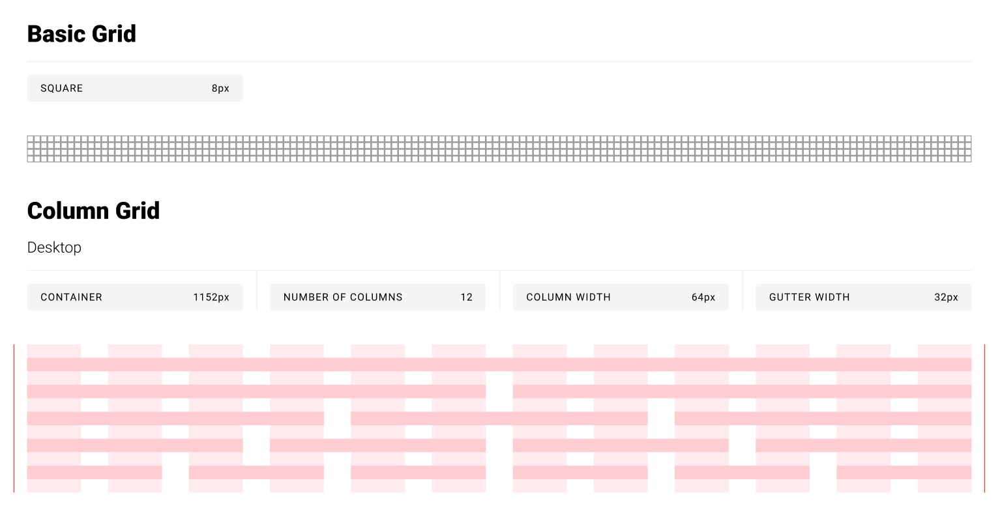
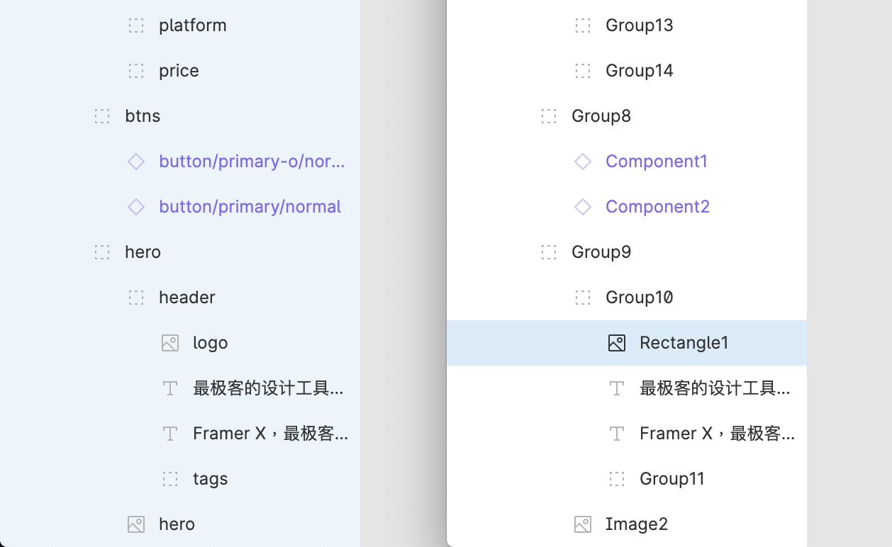
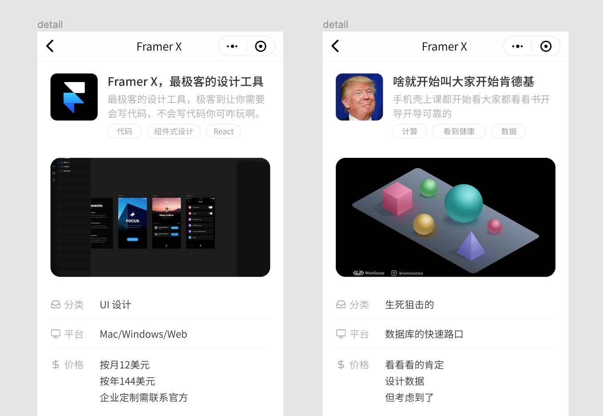

最近听了 [Design Details](https://spec.fm/podcasts/design-details) 的一期播客，讲的是 [The Designer-Developer Handoff](https://spec.fm/podcasts/design-details/315921)，也就是“设计交付到开发”的事情。正好最近发布了自己做的 [Figma Handoff](https://figmacn.com/handoff/)，有感而发，想聊一聊设计交付这件事。

我们总能听到设计师对开发的吐槽，或者开发对设计师的吐槽。在我们的印象中，这两类人是两个星球上的人，拥有着完全不同的思维方式。但工作中我们总是需要互相对接，如果还是给对方贴着固有的标签，就不可避免地导致一些沟通上的损耗。这种损耗表现在最终的结果上，就是我们的产品不能达到预期。

所以，我想说的第一点就是，我们可以先摒弃对开发的固有印象，敢于上前和他们多沟通。**可能你会觉得有些开发不好沟通，但有可能只是你没有使用他们熟悉的方式去沟通而已。**

在这期博客中主播提到的一个做法就挺好的，就是他们会找每一个新来的开发一起，开一个小会给他们讲清楚设计交付到开发的流程，并演示如何使用这些交付工具，比如在 Zeplin 中如何查看样式集合，或者在 Figma 中如何导出图标。

当然，仅仅在事前讲清楚还是不够的，在真实的对接中还是会遇到很多小问题。对于这种情况主播介绍了他们的一个经验，在我看来和开发之间所谓的“约定大于配置”有点相似。举个例子，你所有的设计都使用 4x 栅格（4 的倍数），内边距或元素间距永远都只可能是 4px、8px、12px 等等，但是开发在交付工具中却看到了一个间距为 17px。

假如开发不知道你使用的是 4x 栅格，那么他可能就按照 17px 写下去了。但是，如果你事先和他约定好了“我所有的设计都是 4x 栅格，如果你看到某个间距不是 4 的倍数，你可以自己把它改为最相近的一个 4 的倍数，实在不确定可以找我确认一下”，他可能就会自己纠正为 16px 了。

其实很多情况可以事先约定好，比如说你的设计稿都是像素对齐的，那么如果开发看到了小数就可以自己四舍五入一下。还有 Figma 中的切图，开发很容易点到里面切出尺寸不对的图，那么你们可以事先约定好所有的图标都是 16px 宽的正方形组件，这样他们点到了里面一看尺寸不对就知道点错了（此处打个广告，用 Figma Handoff 可以设计师自己切好图，避免开发切错）。

其实，在设计中我们很容易手误，有时候多了一像素，有时候整数尺寸变成了小数，这都有可能。但是，如果我们事先和开发约定好，告诉他们你的设计习惯，就能省去很多沟通过程。毕竟，工具是死的，而人是活的。

播客中还聊到了另一个建议，就是我们可以尝试去理解开发的思维方式，并学会使用他们的开发工具。前文也说到了，我们会让开发去使用交付工具，让他们注册 Zeplin 或者 Figma 账号，反过来想，我们是不是也可以去学一下 XCode、Android Studio 或者 VSCode 如何使用呢？

当然，这并不是说我们要学会完整的开发技能，而是当整个项目环境在我们的电脑上运行起来之后，我们起码应该知道如何改代码以调一下颜色或尺寸这些视觉属性。会使用这些开发工具，自然而然地也会学会他们的思维方式，这对于双方沟通是大有裨益的。

除了播客中提到的这几点，我还有一些比较落地的建议：
- 合理分布图层结构
- 图层合理命名
- 尽量使用真实或者接近真实的填充数据

虽然在很多交付工具中是看不到图层结构的，但是合理地分布图层结构对我们自己影响很大。设计稿中的图层结构和代码中元素的结构虽然不一定完全一致，但也有着很大的相似性，合理分布图层结构，其实就暗含着你引入了一定的开发思维，就不至于做出天马行空的设计。

图层的命名也有很大学问，整齐优雅的命名不仅有助于别人理解，让别人少一步思考，有些命名方式能和开发习惯对上甚至能减少开发很多工作量。比如说图标命名，开发代码中使用 `icon-home` 的命名方式，正好你也是用这种形式，就很容易对上。同时，建议所有图层没有特别必要都使用英文命名，毕竟开发写代码都是用英文的。

最后，设计中的数据，比如商品描述、人物头像、评论等，尽量使用真实或者接近真实的数据。首先，真实数据可以让你提前感知你的设计在真实环境中是什么样的。假如说有一个商品列表页面，每一个商品图你都用了特别好看的插画，这样设计时看起来可能很好看，但是一旦上线变成用户上传的图可能就惨不忍睹。其次，数据尽量接近真实可以减小开发理解成本。

其实，要把设计交付开发这件事做好，说到底还是“多沟通”三个字。借用最近在看的《[因计算机而强大](https://book.douban.com/subject/30418117/)》这本书里的观点：**“我们的文化分裂为‘人文’与‘科学’两种领域，这让他们感到安全……它构成一个怪圈：文化越是分隔，被分隔的两方越是各行是”**。虽然我们的工作内容不一样，思维方式也不太一样，但我们不应该互相排斥，而是要互相学习。
