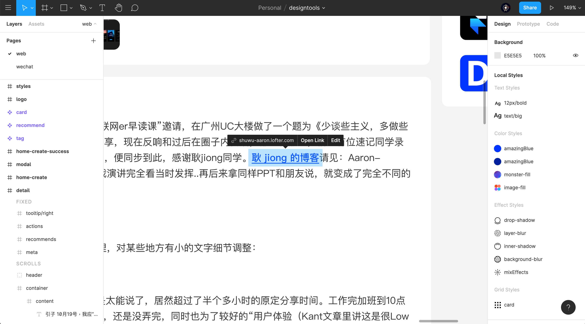
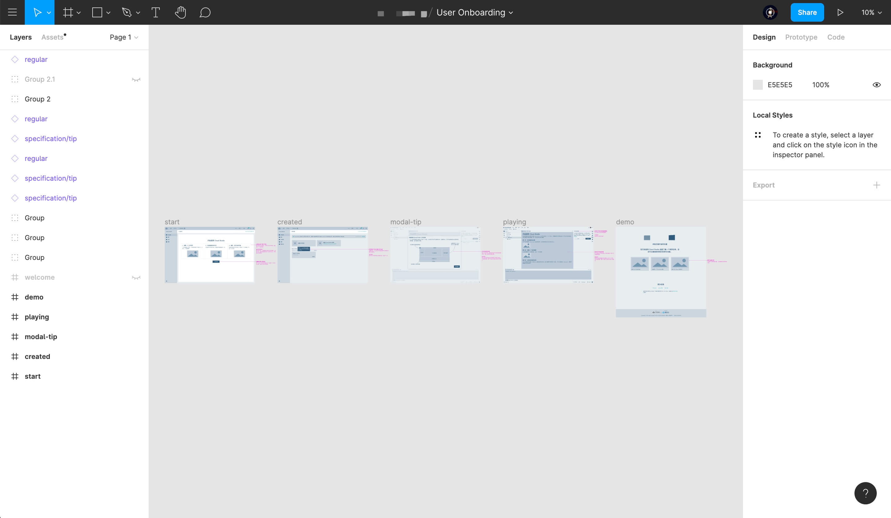
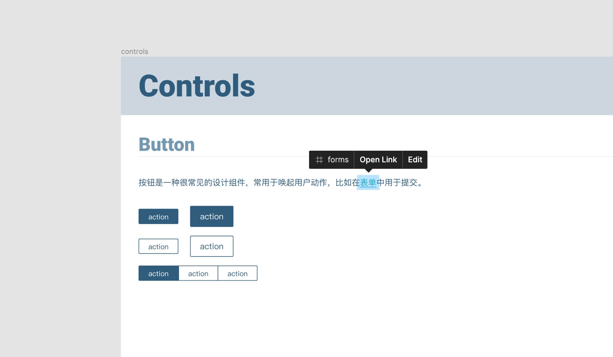
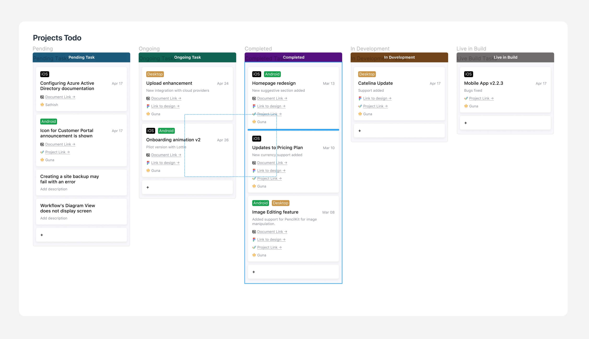
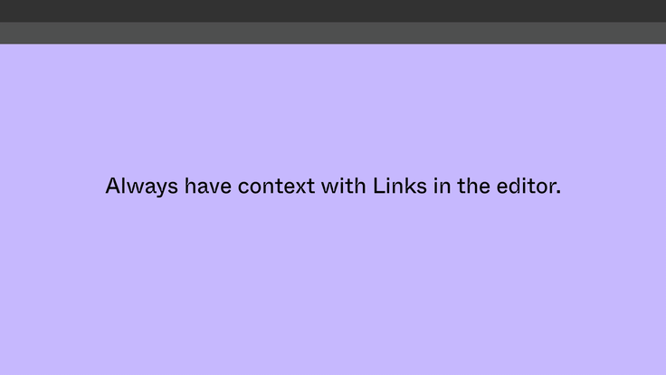

界面设计工具 Figma 近一两年得到了不少关注，越来越多的设计师开始讨论或尝试这款设计软件。Figma 的成功，很大一部分得益于他们一直倾听社区的声音，从用户的角度出发，并持续扎实地输出各种新特性。

从最初他们重新构建了矢量绘图的方式，用[矢量网络（Vector Network）](https://www.figma.com/blog/introducing-vector-networks/)让矢量绘图更加符合直觉；到后来极其自由的组件系统、Smart Animate、Auto Layout 和社区等，每一个功能都给设计师带来了效率上的提升或思维上的改变。

最近 Figma 又发布了一个新功能：**画布内链接，也就是说可以在设计图中直接添加跳转链接，既能够在不同的设计页面间跳转，还可以跳转到外部页面**。

## 画布内链接的玩法
画布内链接看起来是一个不大不小的新功能，但是我觉得它极大地拓展了 Figma 的使用场景。Figma 毕竟是一个界面设计工具，设计师在里面只能完成界面设计的工作，而其他工作诸如用户调研、文档编写等工作需要在其他更专业的工具中完成。在以前我们可能会把链接写在设计图旁边的注释中，让其他人复制查看，但现在可以直接添加链接，对方访问更加方便了。

有了画布内链接，基于 Figma 的自由和协作，我们其实可以做挺多事情。

### 产品交互文档
在国外产品设计师一般会兼顾交互和 UI 的工作，很多设计师都会使用 Figma 来做交互原型。之前可能更多的是交互原型加简短的注释说明，而现在我们完全可以在 Figma 内完成更丰富的产品交互文档，涉及到用户调研报告这些内容可以很方便地链接出去。

像之前我会在交互图旁边加注释，现在则可以添加涉及到的链接，让产品交互文档浏览体验更好。

### 设计系统

Figma 本身就非常适合构建设计系统，有了画布内链接，我们就可以在不同的页面之间添加跳转了。目前市面上也有挺多构建设计系统的工具，但是还需要把设计同步过去，现在在 Figma 内就能完成了。

比如下图，我可以在文档中添加跳转，把不同的组件关联起来，当然如果涉及到外部链接也也可以直接添加。

### 设计知识库
我之前所在的设计团队有定期分享的习惯，大家会在每周五下午分享一些网站、文章，并在一个地方记录下来，相当于是整个设计团队的知识库。之前我们尝试过 Wiki，后来换为 Trello，现在如果整个团队在用 Figma，那只需要维护一个设计文件就好了。

你甚至可以设计一个[支持 Auto Layout 的看板](https://www.figma.com/community/file/833039195201856572)，每位成员可以在里面动态添加带链接的卡片，借助 Auto Layout 动态元素的特性，你甚至可以像真实的看板那样直接拖拽卡片进行分类。

### 简历或作品集
Figma 是在线的，用它做简历或作品集非常方便传播。与此同时，你的简历或作品集也是你的作品，而 Figma 文件就是源文件，可以让对方直接看到你的设计细节，直接能体现你的设计水平，浏览导航也更加方便。唯一的缺点可能就是国内的 HR 还不太习惯线上简历或作品集，而且 Figma 打开有点慢。

## 向上下游进击
接下来我想聊聊我从这个特性看到的一点趋势，并探讨一下 Figma 为什么这么做。

**作为一款界面设计工具，Figma 最早做了两件事情改变了设计工具，甚至于改变了设计师的工作方式和设计思维。第一件事是把设计工具放进了浏览器，第二个就是引入了多人协作。**可能一开始协作只发生在设计师之间，但是后来设计师的上下游也加入了，比如产品经理、开发人员、市场人员都会加入，在 Figma 中完成和设计师协作的事项。比如市场人员加入协作，直接按需下载设计好的素材（免费查看者可以自己选中元素并选择格式和大小来导出图片），甚至于设计师给他们编辑权限让他们自己给素材模板改文字导出。

这种工作模式提高了设计师和上下游之间的协作效率，让设计过程更加开放透明。随着越来越多的协作人员加入，不同的人员之间需要指引，以便知道对方做了什么。画布内链接就可以提升这种浏览体验，使不同人员在设计文件中浏览更方便，还能随时连接到外部内容。

现在很多工具都在加强协作，Figma 也在朝着这个方向走，无论是提供画布内链接来加强文档属性，还是通过开放的 API 来完成设计到开发的交付，都是在减小设计师与上下游之间的协作阻力。

产品界面设计从来就不是设计师一个角色的事情，一款成功的产品需要产品经理、设计师、开发人员、市场运营以及其他角色一起合作才行，而一个开放的设计平台无疑会加速这个过程。

**参考：**
-  [Look no further: New ways to search and provide context in Figma](https://www.figma.com/blog/new-ways-to-search-and-provide-context-in-figma/)
-  [Want Figma API inspiration? Here's 8 community powered projects](https://www.figma.com/blog/want-figma-api-inspiration-heres-8-community-powered-projects/)