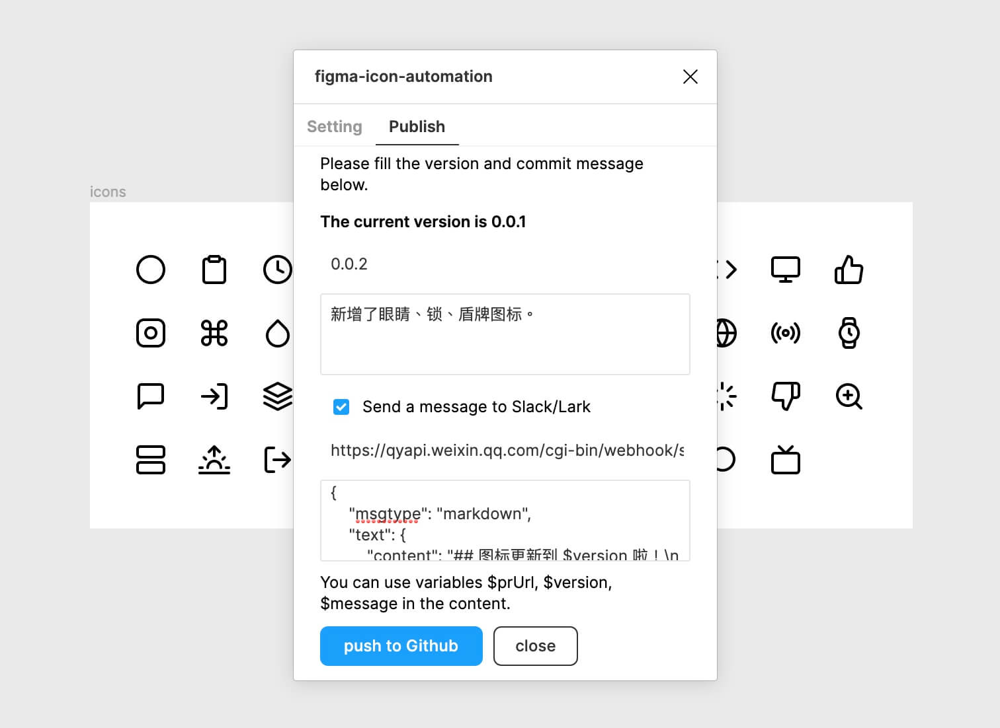
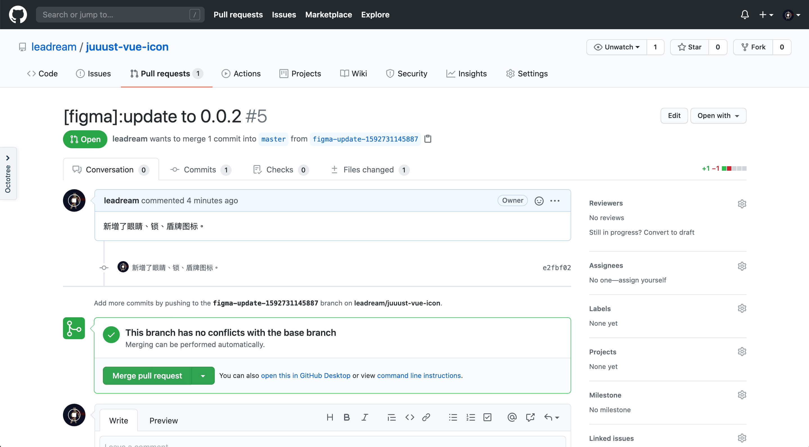

[Figma](https://figma.com) 是我最喜欢的设计工具，它把设计从本地带到云端，让设计协作成为可能，更重要的是可以[通过 API 获取云端的设计数据](https://www.figma.com/developers/api)，让设计的工程化更加容易。而 GitHub 设计团队很早就开始使用 Figma 了，他们的设计师发布了一套[如何从 Figma 自动生成图标的流程](https://github.blog/2018-04-12-driving-changes-from-designs/)。2018 年 GitHub 发布了 Actions，可以通过编写脚本自动化一些流程，借助于社区的力量，我们可以轻松地组合各种已有 Action 来实现自己的自动化工作流。

GitHub 的图标自动化给了我很大启发，于是在 Figma 去年开放自己的[插件平台](https://www.figma.com/blog/plugins-are-coming-to-figma/)时，我就开始研究[如何通过 Figma 插件来交付图标](https://mp.weixin.qq.com/s/7_hb1rB2KF-1D7d2GNjl9g)，直接从 Figma 文件生成图标的 React 组件代码。我觉得这应该是东半球最先进的图标交付方式了，因为**从始至终都不需要设计师和开发离开自己熟悉的工作环境，也不需要他们讲一句话**，极大地提升了交付效率。

不过最开始的时候这个插件只支持直接从设计文件生成 React 组件代码，后来很多朋友问我什么时候支持 Vue，毕竟 Vue 还是比 React 用得多。最近我经过一番折腾，终于搞定了，现在它支持生成 Vue 组件代码啦！而且，我还给它加了通知功能。

下面我想给你讲一下整个交付流程是如何工作的，以及它是如何使用的。

## 它是如何工作的？
我在上文提到的[文章](https://mp.weixin.qq.com/s/7_hb1rB2KF-1D7d2GNjl9g)中说到过，经过这些年的演进，图标从雪碧图到 iconfont，再到 SVG 图片，以及内联 SVG 代码的 React/Vue 组件，组件无疑是目前最方便的模式了。但是和其他形式的图标一样，我们也需要手动处理设计师给我们的 SVG 文件，把它变成 React/Vue 组件代码才可以使用。

但是因为 SVG 本身就是代码，所以这中间有很多流程都可以通过自动化的方式去解决。总的来说，我所实现的这个流程分为以下几步：

- 首先，设计师在 Figma 中设计图标，并将每一个图标设置为设计组件；
- 每次更新后打开[插件](https://www.figma.com/community/plugin/739395588962138807/figma-icon-automation)点击发布，这个插件会向一个 GitHub 仓库提交一个版本更新的 PR；
- 在 GitHub 中合并 PR 后会触发 GitHub Actions 自动脚本，这个自动脚本会通过 Figma API 拉取 SVG 代码，经过处理后生成 React/Vue 组件代码；
- 将生成的组件代码并发布到 NPM，发布成功后通过企业微信或者飞书的 Webhook 在群里通知开发更新；
- 最后，开发收到通知后在终端通过 yarn 或 npm 命令更新，就可以使用最新的图标了。

在下文中，我将详细介绍 Vue 版本的使用方式。

## 它是如何使用的？
### 在 Figma 中设计
最开始，设计师在最喜欢的 Figma 中精心打磨每一个图标，并将它们都做成组件。这里需要注意的是，我们要给图标合理命名（目前不支持包含斜线，否则会被识别为文件夹层级）。

### 安装并配置插件
我们先到 [Figma Icon Automation 插件主页](https://www.figma.com/community/plugin/739395588962138807/figma-icon-automation)中安装一下这个插件，然后需要在插件中填写一些基本配置。前面提到，这个流程需要涉及到 GitHub，所以我们要现在插件中填写 GitHub 的仓库地址和 token。

仓库地址我分别写了一个 [React 版本](https://github.com/leadream/juuust-icon)和一个 [Vue 版本](https://github.com/leadream/juuust-vue-icon)的，大家可以根据自己当前项目技术栈去选择 fork 一个仓库，把自己的仓库地址填在这里。GitHub token 可以在 [GitHub 开发者设置](https://github.com/settings/tokens/new)中生成，**记得勾选下面的 repo 全部权限**。

### 配置代码仓库
前文中提到，自动化的流程都在代码仓库中通过 GitHub Actions 执行，这个过程是通过代码仓库中的 `.github/workflows` 里面的脚本定义的。

从上面的脚本中可以看到，这个流程需要使用到的一些密钥，比如 Figma 的文件链接和 token，NPM 的 token，企业微信机器人的 webhook 链接等，我们需要先在仓库的 settings->Secrets 中添加好。

这些密钥的获取方法如下：
- **`FIGMA_FILE_URL`**：Figma 图标文件链接
- **`FIGMA_TOKEN`**：在 Figma 的个人设置页面获取
- **`GH_TOKEN`**：上文生成的 GitHub token
- **`NPM_AUTH_TOKEN`**：NPM 账号 token
- **`WECHAT_WORK_BOT_WEBHOOK`**：企业微信机器人的 webhook（不需要发消息通知可以不要）

### 通过插件一键更新
上面那些都配置好之后，我们就可以在 Figma 中一键发布新版本图标了。插件会自动获取到当前的版本号，我们只需要填写一个高于当前版本的版本号，以及更新内容，如果想要获得通知还需要填上企业微信机器人的 webhook 地址和通知内容，就可以发布了。

发布成功后，在企业微信会收到一条通知。可以看到，刚才的操作为我们生成了一条新的 pull request。

### 合并 PR 触发自动化流程
现在，我们打开这个 PR 地址，前往代码仓库去合并它。

这个合并的操作，会触发 GitHub 的自动化流程。

因为我在里面配置了企业微信通知，所以在这个过程执行完之后，会自动往企业微信发送通知。

可以看到，上面的自动化流程还是用 GitHub Pages 的 Action 自动生成了一个在线网页，我们可以在这个网页中查找和复制图标名称。

### 在终端执行命令更新并使用
接下来，我们就可以在终端执行命令安装或者更新图标了。更新之后，在代码中使用 `import { Clock } from 'juuust-vue-icon'` 的方式引入图标组件，还可以通过 `size` 和 `color` 来控制尺寸和颜色。

## 它为什么高效？
上面的过程看起来有点复杂，我为什么说它高效呢？因为这是第一次使用，需要配置很多东西所以看起来有点复杂。在第一次配置完成之后，后续的使用就很简单了。**设计师每次更新时打开插件，填写新的版本号和修改内容，一键提交；企业微信机器人通知开发，开发点击 PR 链接合并它，触发自动化流程；图标被发布到 NPM 之后，企业微信机器人再次通知，开发就可以使用命令行更新图标。**

同时，它也是很灵活的，这个插件只是通过 GitHub 的 API 生成一个版本更新（只改动了 package.json 中的 version）的 PR，图标的处理过程都在 GitHub Actions 里面。所以你可以根据自己的需求修改代码仓库中的自动化流程，修改图标展示页面，如果你想用其他代码托管平台（比如 GitLab），甚至可以修改我的[插件代码](https://github.com/leadream/figma-icon-automation)，不过就没有这么丰富的 GitHub Actions 可以使用了，需要使用对应平台的 CI 来自己实现。

目前，我们团队已经使用这套流程来交付图标了，整个过程只需要设计师和开发在接收到通知后点几下即可完成交付过程，节省了不少时间。现在很流行「设计系统」这个概念，它的作用主要就是减少设计到开发之间交付的一些阻力，而图标自动化交付就是我对「设计系统」的一个实践。
