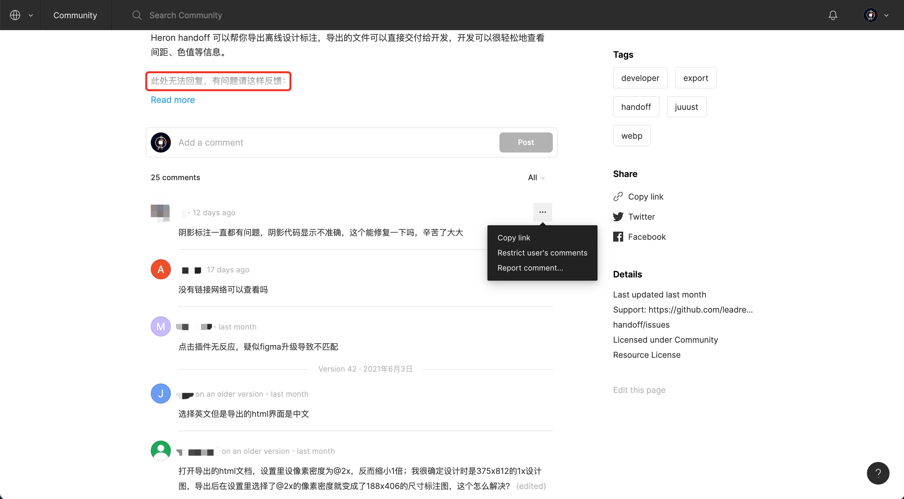
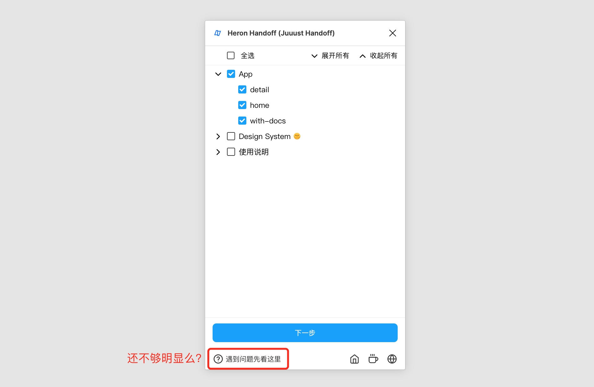
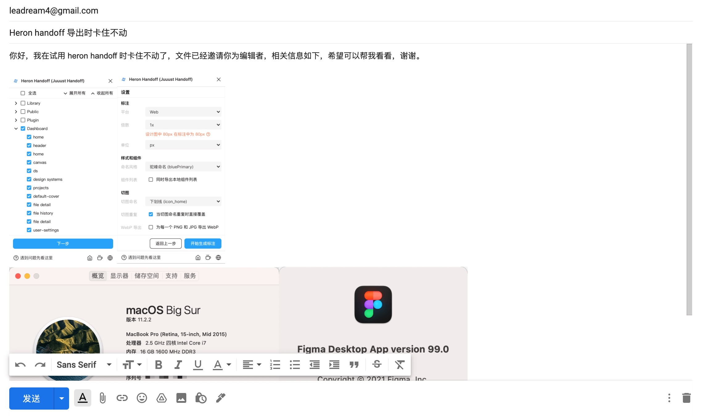

在很久之前我做了一款 Figma 离线标注导出插件——[Heron handoff](https://mp.weixin.qq.com/s/-ELwsHjcxihoKkpjPqzNdQ)，开源并且免费。最近因为使用的人数越来越多，很多用户遇到问题时会过来问我。但是我发现很多人不是很“擅长”提问，这给我带来了一些困扰。所以今天就想聊一聊这个问题——在使用免费开源软件时遇到问题该怎么办？

## 有些问题不用问，可以自己先试试
我曾遇到过有人问我 Heron handoff 没有网络可以用吗？这个问题根本没必要问，在电脑上断开网络试一下就知道结果了。所以遇到问题并不一定要问作者才知道答案，多动手多尝试永远没错。

## 学会查阅文档
一般来说，开源软件的作者都会写一份文档来帮助使用者。所以，在遇到问题时请先查阅一下文档，一般都能找到答案，因为这个问题可能之前已经有人遇到过了，作者已经把它加入常见问题了。

比如在 Figma 的 [Heron handoff](https://www.figma.com/community/plugin/830051293378016221/Heron-Handoff-(Juuust-Handoff)) 插件页面，很多用户遇到问题都会在这上面去评论，但是这里面大部分问题我在[文档](https://docs.heron.design/designer/)中都有写。关键是这个页面无法回复评论，所以我只能看着这些问题干着急。虽然我也在插件介绍中写了「此处无法回复』（下图红框中），但依然挡不住很多人继续在这里问。

我就想，会不会是这里不显眼，而且插件界面中文档入口只有一个图标也不太明显。于是乎我花了几分钟把插件界面上的文档入口改得更加明显了，但是还是有人在这里继续评论😂，虽然少了点。

我明白了，原来很多人没有查阅文档的习惯，喜欢直接和作者联系获得即时的反应。其实学会看文档，能够解决人生中的很多问题，而不用麻烦别人。

## 把问题问清楚
第三个让我烦恼的是，很多人无法清晰描述问题。比如，有人就说五个字「导出卡住了」，这五个字对我来说没有任何意义，我根本无法帮他排查问题。如果查阅文档找不到答案一定要问作者，那么在提问时请把问题描述清楚，你可以说明卡在哪里，在导出时选了什么设置，必要时可以截图给我，邀请我进入你的设计文件来复现问题，信息越多我越好排查并解决问题。

## 提供详细信息
接着上面的说，除了把问题问清楚，最好还能够提供一些详细的信息，让作者更好地了解你当前的“上下文环境”。因为，不同的用户使用不同的硬件设备、操作系统、软件版本、网络环境，软件出现问题可能和这其中的任何一个点有关，作者不可能测试过各种环境，也没有上帝之眼，需要更多的细节来找到问题所在。

下图是一个提供详细信息的正确示例。

## 学会讲礼貌
我一直觉得很多人不懂互联网礼仪，这给我带来很不好的感受。首先我们明确一下开源免费软件作者的义务边界，既然已经开源免费了，帮助使用者解决问题其实不是必须的义务，而是一种额外的付出。所以，如果作者帮助用户解决了问题那是因为作者热心有开源精神，没有帮你解决问题也没什么错。所以，请务必在作者帮你解决问题之后说声谢谢。

再者，开场很重要，不管是邮件联系还是加微信，请务必说明意图。有些人在加我微信时没有任何备注，我都不知道是谁（谁知道是不是王阿姨给我介绍的对象啊），所以在添加作者微信时务必备注一下原因。

希望大家看完这篇文章之后能够知道如何更好地解决问题，也能更友好地向开源软件作者提问，让我们一起把开源的世界变得更美好。