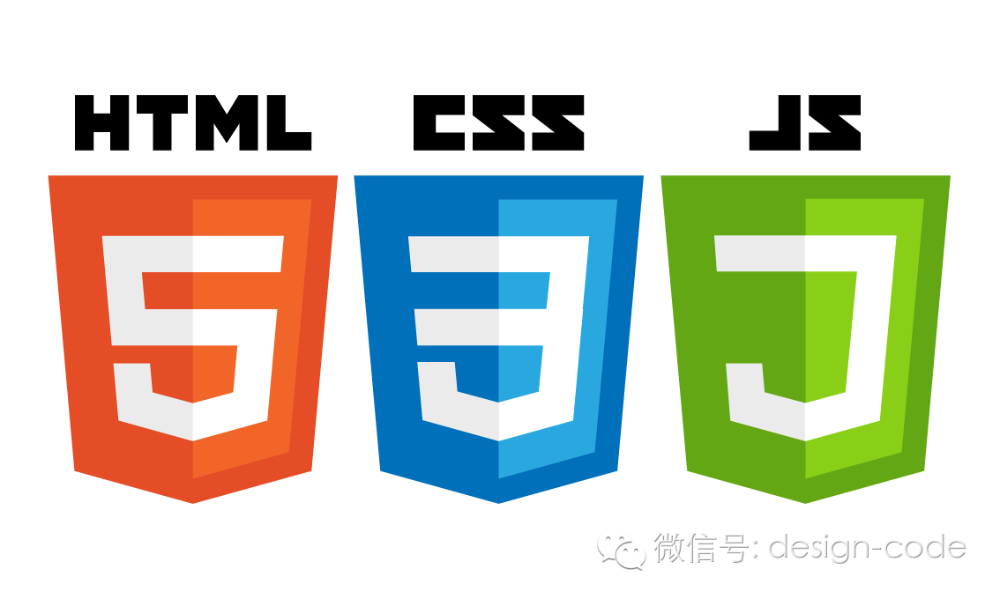
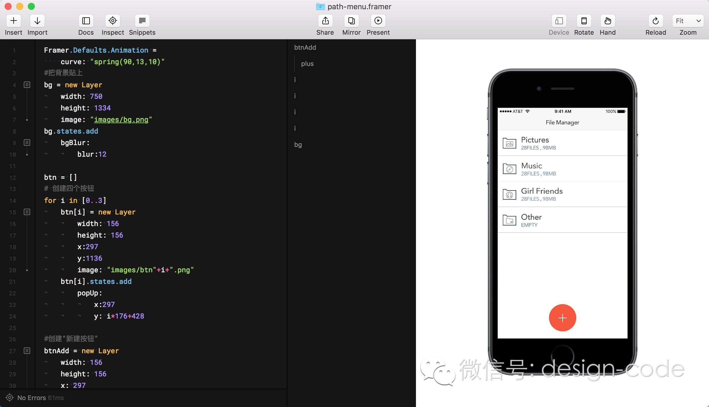
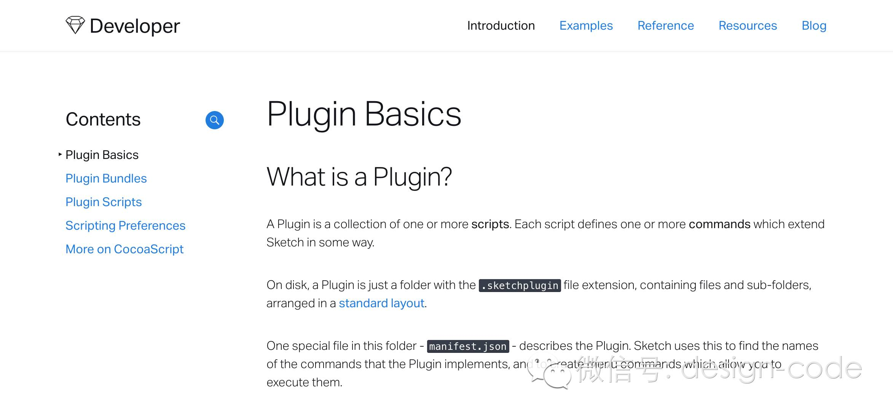
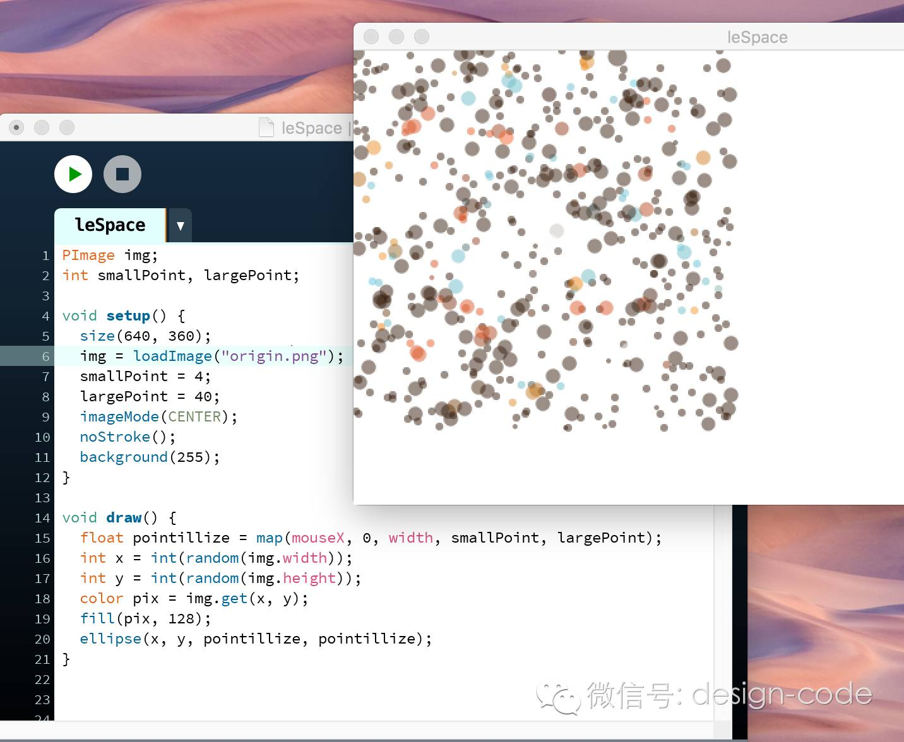
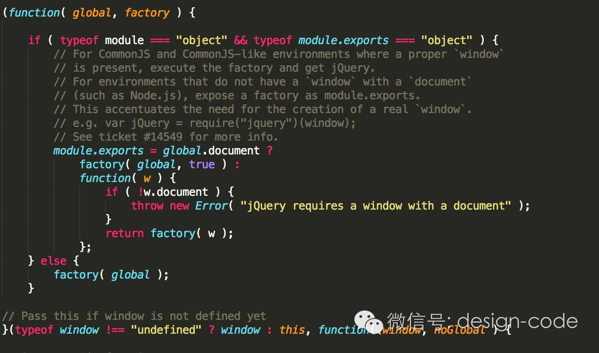

前端这两年火了，尤其是依托于微信传播的 H5（这个名字其实很不标准）漫天飞之后。很多非程序员尤其是设计师开始在这个时候对前端产生兴趣。而对于找工作的设计师来说，有一定的编程基础也会更受青睐。

前端作为一种比较偏向视觉化的编程技术，对于想学编程的非程序员来说确实是一种比较适合的编程语言。但是在我和很多设计师打交道的过程中，发现大部分人对于学习编程会存在一些误区。

比如很多人虽然想学但又认为编程太难有排斥心理；相对地也有一些人用 CSS 写了一些样式会觉得前端很简单；还有些人不知道从何下手，就开始啃起了枯燥无味的 w3school 文档（web 技术中文文档）。于此我觉得设计师想学会写代码一定要对编程有正确的认知，既要对技术保持一颗敬畏的心，又不能从潜意识里排斥它。

我做了两年前端开发，同时也做过许多设计的工作。基于自己的经验，对于设计师学编程这件事我有一些自己的想法和建议想分享给你。

## 术业有专攻

可能有些设计师想精通编程，成为一个全栈设计师，但我不太赞成这种想法。毕竟“术业有专攻”，每个人一生的精力有限，根据“一万小时理论”（想要成为某个领域的专家需要持续学习一万小时），要想成为设计大咖已经要花费很多时间了，想同时在技术这一领域有所造诣短时间也是达不到的。

但是因为前端经常做一些视觉化的开发，比如写外观样式和交互动画，加之 CSS 和 HTML 语法看起来比较简单，常常会给设计师造成一种假象：前端不是很容易学吗。可是，不同于以前网页设计师仅仅做一些视觉还原的工作，现在的前端工程师要做的工作范围极广，写写样式调调动画只是其中一部分。从这个职位属性的变化——从设计师到工程师——就可以看出来，一名合格的前端工程师除了能够还原页面视觉，还要有工程化的思维，对数据结构有深刻的认识，有时候还需要一些计算机网络的知识，对后端也要有一定了解。这几年前端技术发展飞快，各种框架及工具层出不穷，新技术不断出现，想要追上却力不从心。**所以说，前端入门容易但想要学深学透却“难于上青天”**。

说了这么多，其实是想告诉你要明确学习编程的目的。如果你想从设计师转行成为一个前端工程师，那么可能就要心无旁骛地去从计算机科学这门学科的基础知识开始学习了。但我相信大部分设计师的目的是想成为“T”型人才——在设计领域是专家，而对于技术领域也有一定程度的涉猎。所以，学习编程对我们来说就是为了增加自己的附加值。

## 靠兴趣驱动学习

明确了学习目的，那我们的学习方式也应该是有别于工程师的学习方式的。我认为设计师学习编程最快也是最有效的方式就是通过兴趣驱动学习——没有什么比看见自己用代码写出一个小 demo 更让设计师开心了。

当然，除了满足感我们还能得到一些切实的好处。我从四点分别讲述，同时推荐一些编程语言或软件。

### 1、了解一定的开发原理，和工程师沟通更顺畅

推荐使用交互原型工具 Framer 进行一些动效设计，它将视觉设计和编程相结合，虽然代码不能直接拿去用，但能够让你和开发工程师沟通起来更加顺畅。

### 2、自己能够编写Ps和Sketch插件，通过代码减少重复性工作

Ps 和 Sketch 都支持插件扩展，同时支持多种语言风格书写插件，所以你可以选择自己熟悉的语言编写。当遇到重复性的操作时，你就可以自己写个插件提高工作效率了。

### 3、代码也是一种艺术，编程就是换一个角度进行艺术创作

Processing 是一款可视化编程软件，很多设计师通过 Processing 创作出一些很棒的作品。在Processing 里，代码就是一支画笔可以让你画出一些意想不到的作品，设计师玩了这个绝对会爱不释手。

### 4、可以按自己的想法做出个人网站

能自己独立完成个人网站需要很多知识积累。到这一步的设计师应该已经在代码里摸爬滚打很长时间了，各种需要使用的技术都能懂一些。

## 需要注意的细节

最后，说一些细节问题，希望能给你在学习编程的路上一些指引。

### 1、永远不要畏惧代码

很多设计师会对代码有一种潜意识的排斥，但其实是被自己的眼睛欺骗了。如果静下心来，“摒弃前嫌”地看一段代码，你会发现好像也可以看懂，它好像也没那么难。

### 2、思维的转变

编程的思维和设计的思维肯定是不同的，编程会更加注重抽象能力，很多具象的东西在代码里就抽象成了数据。所以，最好的方式就是在写代码时把自己想象成一台计算机。

计算机的特点就是能快速计算，所以代码里所表现的一些过程其实就是很原始的方法，比如计算 1 到 100 的平均值，在代码里就是把它们一个个加起来除以100。但是，最后肯定需要人为的地进行一些算法优化。

### 3、注意格式

正如在设计中将文字、图案对齐一样，将代码对齐、按规范书写将会是一个好习惯。诚然，一团乱麻的代码没有报错也能正确执行，但是考虑到以后你可能会再次阅读自己的代码，还是把它对齐并按照规范写吧，不然下次读自己的代码时你可能会想杀掉之前的自己。

更何况，简洁优雅的代码看起来简直是一件艺术品。

### 4、数据类型及代码结构。

编程语言有很多种，但是它们的数据类型和代码结构却大同小异。比如数据类型无非就是数字（number）、字符串（string）、布尔值（boolean）、对象（object）等，而代码结构无非就是条件、循环等。所以，在准备编程之前能够了解一下这些基础知识，将会在以后写代码时减少很多不必要的时间。

在 Framer 官网有一个章节就大概讲了这些内容，推荐你去看一看。地址是：https://classic.framer.com/guides/programming/ 。

以上所述，都来自于个人经验，未免有些错误或疏漏，仅供各位参考，但不可尽信。希望我的这些经验能开启你的编程之路或在你编程时给你一些切实的帮助，如果有任何问题也可以留言探讨。
