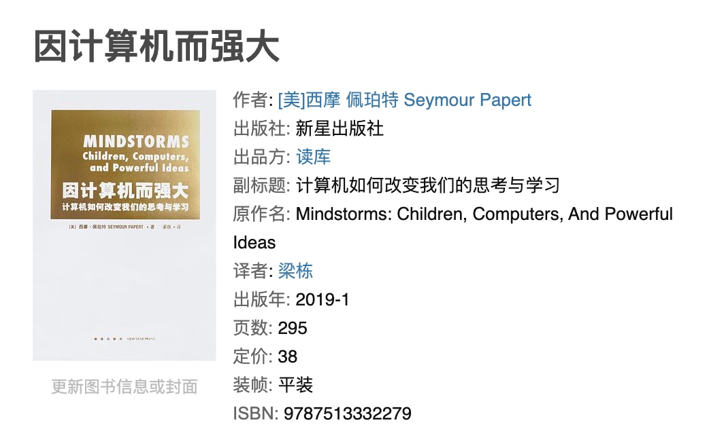
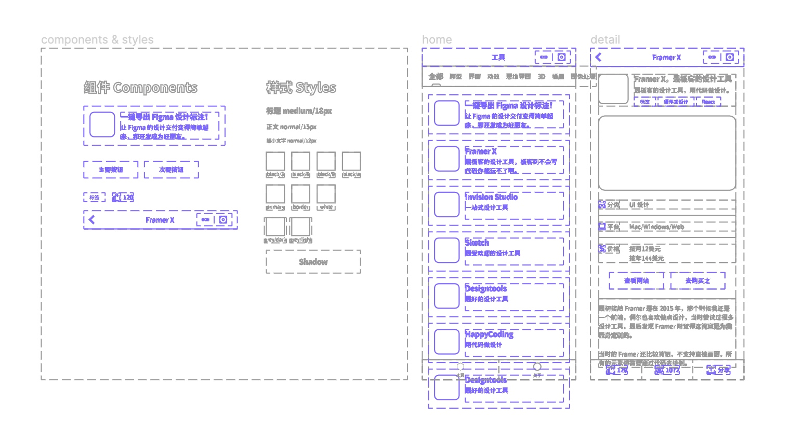

近两年全栈全链路跨界经常被提及，我遇到过一些设计代码双栖甚至多栖的大佬，也见过很多自称全栈的设计师。我自己也是从开发一路转行而来的设计师，对这个话题有一定的发言权，就想结合自己的经历和大家聊聊设计师该不该给自己设限。

我曾读过一本书，叫做[《因计算机而强大》](https://book.douban.com/subject/30418117/)，是一本讲计算机教育的书，书中说到：**我们的文化分裂为“人文”与“科学”两种领域，这让他们感到安全……这个巨大的分裂全面贯彻于我们的语言、世界观、社会组织和教育体系之中。它构成一个怪圈：文化越是分隔，被分隔的两方越是各行其是。**

自然界从来没有对知识进行划分，人们将知识分为不同的学科，再细分为不同的职位，是为了适应社会发展，让其井井有条地运转。细分固然有其好处，可以让每个人各司其职，但是也会让知识禁锢在各自的小圈子内，但有时候知识的融合贯通会给人带来惊喜。

就比如现在的互联网行业，职位已经极其细分，产品、交互、用研、UI、视觉等等，每个人只负责自己的一亩三分地。虽然大家的产出更加专业了，但是因为每个人都只知道这个系统的一部分，一定程度上增加了沟通成本。比如大家经常吐槽的开发还原不够，或者 UI 只会给原型上个色，究其原因大概都是各扫门前雪，你家门口的我不管。

好在现在大家意识到这个问题了，开始提倡让复合型人才。从阿里将设计师分位创意设计师和体验设计师，到腾讯新增产品体验设计师，可以看到未来被细分的职位大概率会合并。那么我们是不是要提前准备，不给自己设限，多点亮一些技能树呢？我来结合我的经验给大家讲讲我的看法吧。

## 先把专业的学深入，再横向发展
其实无论职位怎样划分，企业对于在某一领域有深厚功底的人肯定是不会拒绝的。**我认为设计师是不应该给自己设限的，但前提是你必须要有一个特别擅长的领域。**打个比方，一家韩式料理送的小菜特别好吃，并且主菜也都非常棒，你肯定会去了再去；但是，假如你第一次去吃完后发现，原来只是小菜好吃，主菜很一般，我想你大概率不会再去了。

我们的主业就像是主菜，而其他技能就像是小菜。作为一个 UI 设计师，肯定要先在界面设计这一块特别专业，再去学习一些其他技能；作为一名前端，肯定首先要把代码写得很漂亮，会做一些设计才会给你加分。如果到处点亮技能树，但是没有一门可以拿得出手的手艺，就有点本末倒置了。

我自己现在就遇到了这个情况，开发设计产品什么都懂一点，但是你问我最擅长的是什么我就答不上来了。人的精力毕竟有限，我从转行以来自己啥都干，导致精力被分散在各个地方，没有一个拿得出手的技能。面试时曾经被问过：你觉得作为一个设计师会开发对你有什么帮助？我当时回答的是：看情况，如果公司业务是云计算这一类的肯定对理解业务有很大帮助，但是对于其他行业来说可能就是和研发同学沟通方便点。

很多朋友对我说羡慕我，可以自己设计东西自己开发出来，但其实我自己对这个事挺烦恼的（不是凡尔赛）。当初想要转行，是因为真的热爱设计，想要进入这个领域深入发展，但是我发现转行最难的不是刚开始的转变，而是转行后头几年大家对你的身份认同。我转行之后，身边还是有很多朋友介绍我时说我是程序员，甚至招聘软件总给我推荐前端的职位，这给我带来很多困惑。这种混乱的身份让我或别人对我自己无法清晰定位，会让我在工作中变成一块哪里需要往哪里搬的砖，甚至会潜移默化地影响到一些决定。我真的很羡慕没转过行的人，可以潜心于自己的专业领域，无论对外对内都有着很强烈的身份认同。

所以，我劝大家在认清方向之后还是要「术业有专攻」，心有余力再去横向发展。尤其是很多刚进入职场的朋友，前几年是好好沉淀自己专项技能的大好时光，千万不要把技能树点歪了。而且根据我的经验，什么都会一点什么都不精通的人也很难找工作。

## 我所认为的全栈
接下来聊聊我所认为的全栈。身边也有人说我就是全栈，但是我自己不这么认为，我所认为的全栈不是什么都会一点，而是在很多领域都很**精通**。在现实生活中我也遇到过这种人，但是很少，不超过十位。根据一万小时定律，精通一项技能至少需要五年，可是一辈子能有几个五年啊？

我常和别人说，达芬·奇才是真全栈，他有着“不可遏制的好奇心”和“极其活跃的创造性想象力”，在绘画、音乐、建筑、数学、几何学、解剖学、生理学、动物学、植物学、天文学、气象学、地质学、地理学、物理学、光学、力学、发明、土木工程等领域都有显著的成就。和他比我们自然自惭形秽，我们能在两个领域做到精通其实就已经很不错了。

其实全栈也是分种类的，一种是跨度小的全栈，比如我之前所在公司的研发同学大多都是前后端通吃，这种相对来说不是那么难，但是对于工作帮助极大。还有一种是跨度比较大的，比如在设计和研发两个领域，这种就比较难了，毕竟在以前学的是艺术和工程两种不同的专业，转变思维方式就需要很长时间。

## 设计师的全局思维
现在落回到设计师这一职业，我觉得与其想着全栈，不如先从上下游开始了解，让自己更具全局思维更有用。

### 上游业务理解
设计师的上游一般是产品，产品主要是梳理业务需求，规划产品方案。我见过很多设计师，从来不管业务，接到原型就开始画图，有些甚至都不知道公司业务具体如何运转。如果能够往上多思考一步，自己在脑中知道全貌，做设计时自然也会更加顺畅，甚至能发现产品的问题及早提出来，避免浪费时间重做。

### 下游工程实践
对于下游，如果我们能够有一些系统化工程化的思维，输出结构合理的设计稿，研发同学也会很开心的。也许是习惯了自由，我见过很多设计稿结构很乱，看起来在一起的东西图层东一块西一块，虽然研发同学看不到这些图层，但是随意摆放会给他们查看标注造成很多困惑，有时候还原度不够就有这个原因。

如果设计师能有模块化的思维，将每个页面都合理分为不同的模块区域，就会和研发实现更接近，也会给研发同学减少很多困惑。

其实现在的设计工具借鉴了很多编程思维，比如 Figma 的组件、变体等等，让设计师在设计时可以更加系统化，减少很多不必要的脏活累活。如果设计师没有这种系统化的思维，画图时还是「随心所欲」，就有点浪费自己的时间了。

无论是上游还是下游，全局思维都可以让我们更好地沟通，而沟通成本其实是一种很难发现的却很贵的成本。

最后点一下题目，设计师该不该给自己设限？不该，但是要先「术业有专攻」。全栈养成非一日之功，相比于全栈，在工作中有意识地养成自己的全局思维更有用一些。