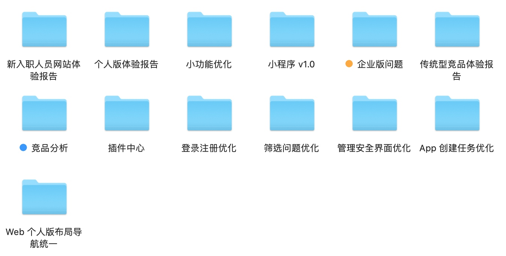
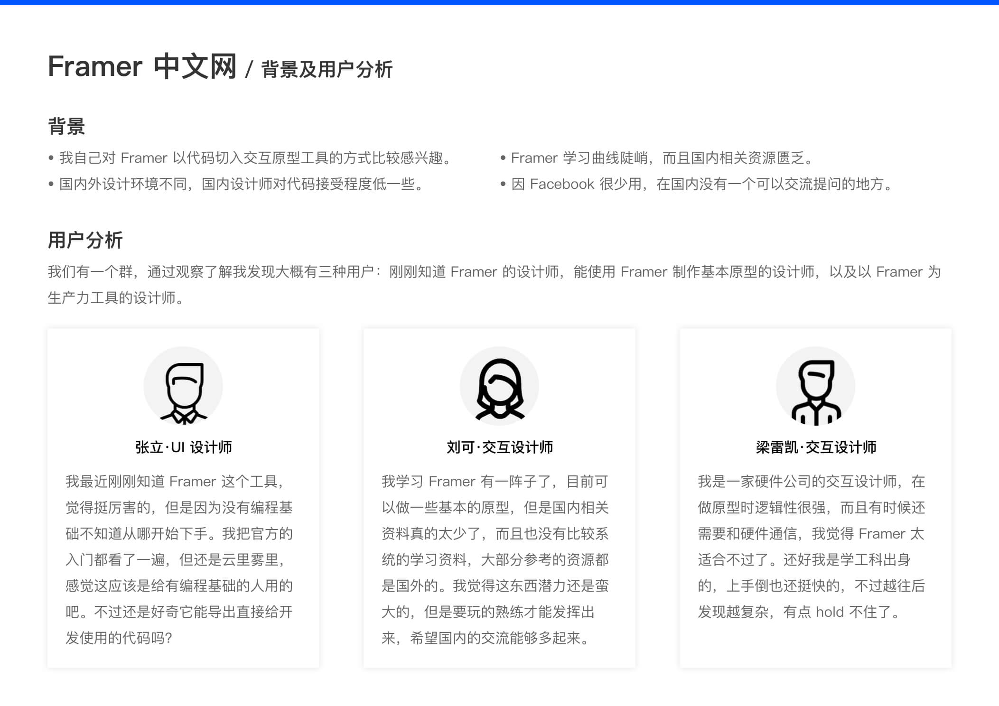
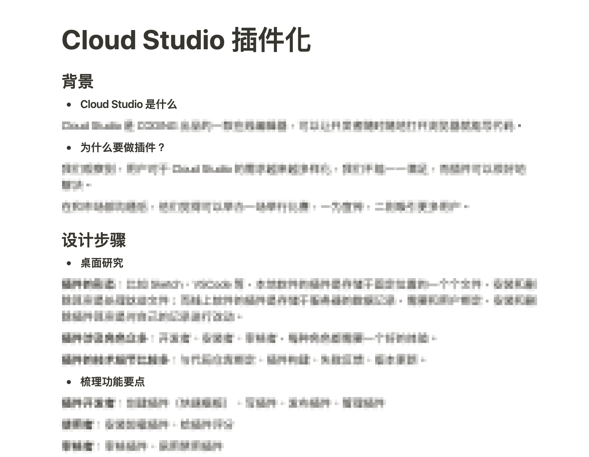

最近在找工作，就重新优化了一下作品集。优化的过程挺漫长的，不过现在已经改得差不多了，就把这个过程中的一些想法想记录下来吧。

## 功夫在平时
我之前没有定期复盘的习惯，这就导致我在最近优化作品集准备找工作时，遇到了很多问题。

首先，在作品集中要写每一个项目的来龙去脉，而我由于时间久远很多细节记不太清，回顾项目时特别痛苦。其次，在作品集中需要放一些截图，由于间隔太久产品说不定已经改版好几次了，也就找不到以前的截图了。当然，这还只是在制作作品集时遇到的问题，更可怕的是在面试时如果被问到很细节的一些问题时都答不上来。

所以大家一定要养成定期复盘的习惯，每次项目的资料一定要整理好，项目前后尽量多截几张产品图，然后写一个只给自己看的项目复盘。这样做的好处，就是当你需要更新作品集时，就可以很快地在现有资料的辅助下去完善它，而不用每次都从零开始。

作为设计师，作品集这个东西并不是只有在找工作时才需要它，我们应该把它看成伴随自己职业生涯的一个东西，定期维护更新。

## 不要套路化
最近听到了很多大佬吐槽，说收到的作品集都是千篇一律用户画像、用户访谈、体验地图。说实话这种事我之前也干过，刚转行时为了让作品集看起来专业，就虚拟了几个用户画像。现在回想起来有点可笑，就好像我是一个刚学会了几个新招数的小孩，迫不及待地要表演给大人看。

虽然设计方法有很多，但是每个项目都是根据实际情况去采取最合适的方法的，并不能生搬硬套拼凑方法论。不然反而会弄巧成拙，很容易被识破。

这么说来，其实还是需要平时多用功，在项目中多实践自己学到的新方法，这样就不需要在写作品集时去搬弄各种套路了。

## 学会讲故事
最近我其实改了作品集不止一次。在找工作之前，我花了好几天把作品集全部优化了一遍，但是后来有几次面试发现在给别人讲解时还是会卡壳。我又重新看了一遍，尝试给自己讲解一遍，发现每页之间都不连贯。

究其原因，是因为我刚开始边回忆边做，想到一点做一点，没有一个全局统筹的意识。于是，我关掉 Keynote，开始尝试先用文字大纲描述每个项目，相当于写提纲，当整个提纲看下来通顺了，再将其视觉化到 Keynote 中。

作品集的作用，就是帮助我们把自己以前做过的项目介绍给别人，告诉他们这个项目的背景，遇到了什么问题，我又是怎么解决问题的。所以，我们要学会讲故事，毕竟面试官一般都是第一次见你的作品，如果自己都不能讲通顺，又怎么让一个陌生人听明白呢？

## 总结
简单地做一个总结吧。首先我们应该把作品集看作一个长期的事情，定期复盘做过的项目，而不是找工作时才更新。作品集也没有标准答案，在我看来就是要老老实实讲故事，至于要怎么讲则完全由你自己决定。当然还有其他一些建议，比如不要太花哨，文字不要太多等等，网上已经有很多大佬总结了，我就不再赘言。