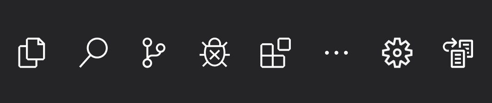
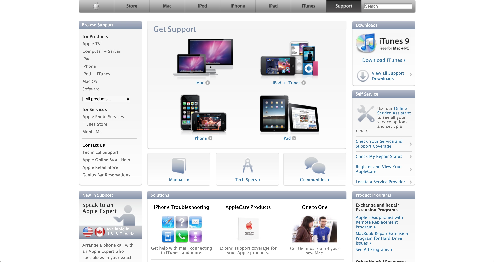
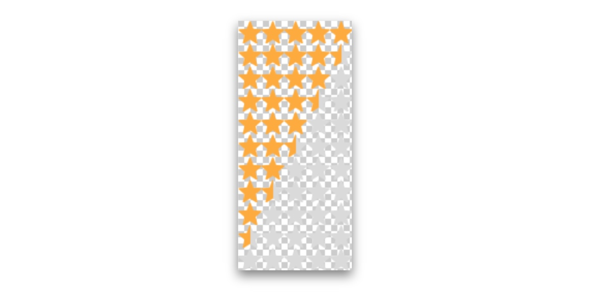
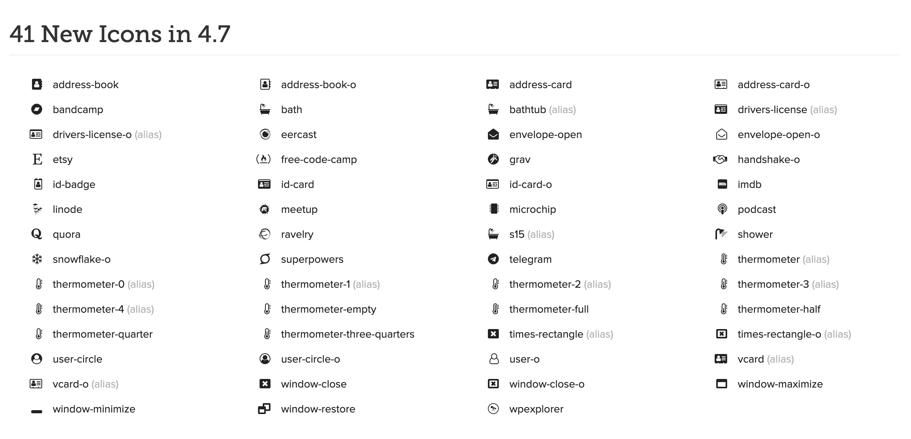
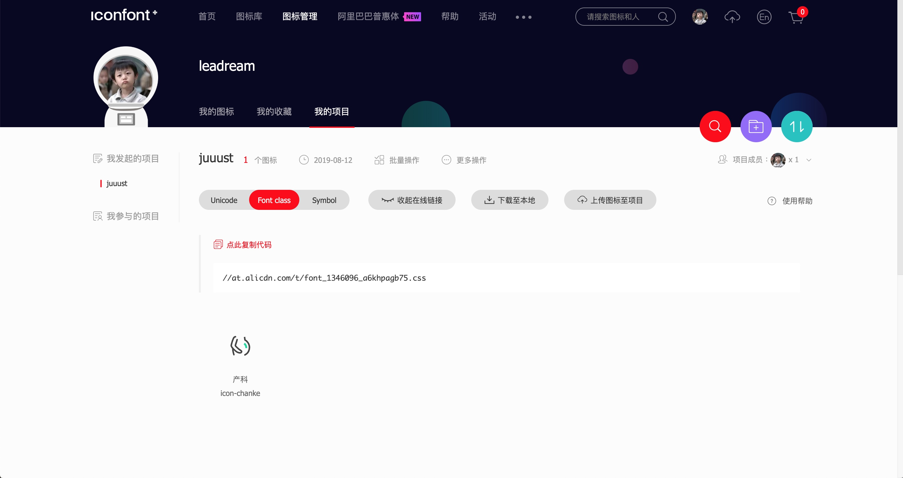
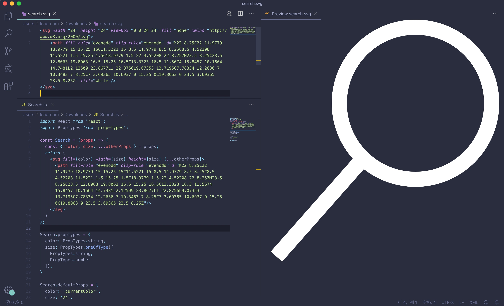
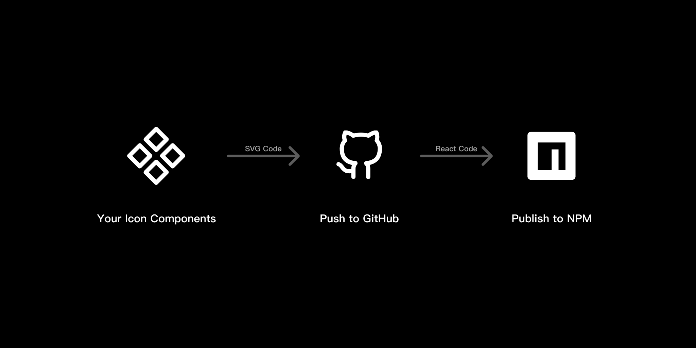

图标在现代 Web 应用中太广泛了，以至于我们都会为自家的产品设计一套图标库。当然了，我所说的图标是指那些单色的、结构简单的图形，比如代表搜索的放大镜，代表主页的小房子等。对于多色的，或者结构复杂的图形，应该叫插画而非图标了（参见[此文](https://mp.weixin.qq.com/s/v3oEimjPWK_-D0mfpXckxw)）。

最近这些年，图标的构成方式一直在发生着变化，从图片、字体到 SVG，而设计师把图标给到开发人员的流程也一直在变化。今天，我来带大家回顾一下图标这些年的交付方式变迁，**然后给大家介绍一种我最近研究出来的一种「不用离开座位」的图标交付方式**。

## 远古时期：切图
大家应该都听过一个很古老的词——切图。在最早的时候，还流行拟物化的设计风格，设计师们还都使用着最古老的传递方式，把对应的图片用 Photoshop 等软件切给开发人员。可以看下图，Apple 2010 年的网页上的图标都还是图片。

这样每当图标有更新时设计师就需要重新切图再次发给开发，而开发需要使用新文件替换旧文件。同时，因为每一张图片都需要向服务器发送一个请求，对于网页的渲染性能有很大影响。为了解决这个问题，人们发明了[雪碧图](https://mp.weixin.qq.com/s/9-Y0H7FBo71TpVQ0rusGBg)，就是把很多图片集中在一张图上，通过位置坐标显示出其中某一个区域。

这样，虽然请求变少了，但是切图更难了。设计师需要小心翼翼地将图标摆在一张图中，以免图片太大，而开发需要逐个确定图标的坐标以写在代码中。虽然后来有了一些工具可以自动化拼图，**但是还是需要文件传来传去，不利于长期维护**。

## 近代：Iconfont
这当然难不倒聪明的我们，有人注意到，网页中的文字是矢量渲染的，放多大都不会模糊，于是一个大胆的想法诞生了：**把图标变成字体**，也就是所谓的 [Iconfont](https://mp.weixin.qq.com/s/ApOfdCXtIDQcg7iFTQlDug)。Iconfont 中最出名的莫过于 [FontAwesome](https://fontawesome.com/) 这套图标库了，因为它包含的图标全而被广泛应用于各种产品。

Iconfont 让图标具有了字体的各种优点：矢量，可以使用 font-size、color 等改变它的尺寸和颜色，让图标在网页中的应用更加灵活。可是，Iconfont 本质上是一套字体，这也就意味着每次更新都需要设计师重新做一套字体。不过还好有 [IcoMoon](https://icomoon.io/) 和阿里的 [IconFont.cn](https://www.iconfont.cn/)，可以在每次更新时自动帮我们生成新的字体。

这个时候，设计师方便了，每次更新直接上传，只需要把开发加进项目即可。可是，**开发还是一样痛苦，每次更新还是需要手动下载字体和样式文件替换到项目中**。

## 现代：SVG 图标
SVG 具有两面性，它既是代码又是图形，随着它的兼容性慢慢变好，我们开始在网页中大量使用 SVG 图标。同时，SVG 图形具有更细腻的属性控制，比如说一套描边图标，我们可以使用 stroke-width 来控制其描边粗细。

随着 React 和 Vue 这两种 Web 框架的流行普及，现代 Web 开发模式都变成组件式的了。而 SVG 本身是 XML 代码的特性，使得它可以以代码组件的形式存在。如果一套图标库每一个图标都是一份组件代码，那么按需加载就成为了可能，比如我们只用到了三个图标则只需要引入这三个图标组件，不会造成代码冗余。

但是，SVG 代码并不是组件代码，还需要将其转换为对应的 React 或 Vue 组件。比如上图中左侧上半部分是原始 SVG 代码，下半部分是对应的 React 组件代码。也就是说，你每次更新完图标设计都需要将 SVG 文件给开发，**让开发手动转换或使用脚本转换，还是比较浪费人力的**。

## 后现代：不用离开座位的交付方式
受到 [Github Octicon 交付流程](https://github.blog/2018-04-12-driving-changes-from-designs/) 的启发，我最近开发了一个 [Figma-icon-automation](https://www.figma.com/c/plugin/739395588962138807/figma-icon-automation) 插件，请允许我称它为后现代的图标交付方式。简单来说，这个插件可以实现的效果是：**设计师在 Figma 中点一下按钮，开发就能接收到更新，并使用熟悉的命令行安装或更新图标的 React 组件。**

这套流程最大的好处就是让设计师和开发都不用离开自己熟悉的环境，就能完成图标的产品级交付。不过，初次配置对于设计师来说还是有点复杂，最好能够和开发同学一起完成。如果你们的产品正在使用 React，可以考虑推荐给开发同学。感兴趣的朋友可以查看[说明文档](https://github.com/leadream/figma-icon-automation/blob/master/README-CN.md)了解如何使用。
