每个设计师应该都想拥有一个个人网站，既能展示自己的作品集，又能打造个人品牌。可是，做一个网站有一定的技术门槛，比如需要懂服务器、命令行、代码什么的。

而如今，你完全不用担心这些事情了。现在各种各样的可视化建站工具层出不穷，而且都有着丰富的模板，让我们可以通过拖拽快速搭建一个还不错的个人网站。在这篇文章里，我将推荐几个适合设计师的网站搭建工具。

## Notion
[Notion](https://www.notion.so) 是一个强大的在线笔记应用，那它为什么会出现在这里？换个角度看，其实我们的个人网站也是笔记，由一篇篇文章组成，而 Notion 又是支持分享成链接的，所以我们也可以把 Notion 作为一个建站工具。

我用 Notion 做了一个简单的示例。可以看到，我们可以自由排布图片或链接，把它做成一个网站的样子。

Notion 还有一个嵌入的功能，你可以把任何在线的内容嵌入其中。比如说你的设计是使用 Figma 制作的，那么就可以直接嵌入 Figma 视图，这样别人在查看时可以直接在这个视图内放大或缩小，来查看你的设计效果和细节。你还可以嵌入 Figma 可交互原型，这样你的作品集就更加生动了。

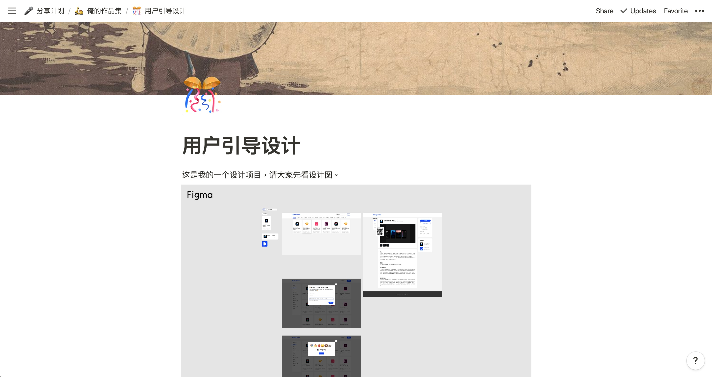

参考：[用 Notion 做网站：设计师的武器库v1.0已上线](https://sspai.com/post/56662)

## Webflow
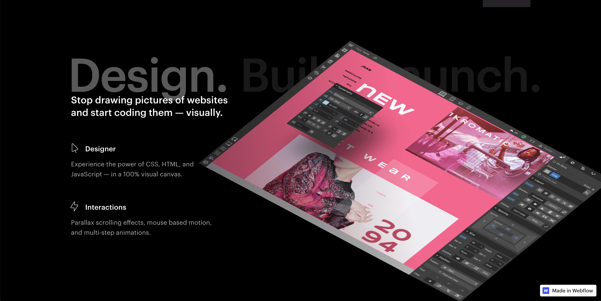

[Webflow](https://webflow.com) 是一个可视化的建站工具，它提供了标准的 HTML5 元素，如标题、按钮、视频等，你可以直接将它拖进画布，来设计出符合语义的网站界面。它还支持 Symbol，即将常用模式（比如按钮）保存起来，在各个地方复用。

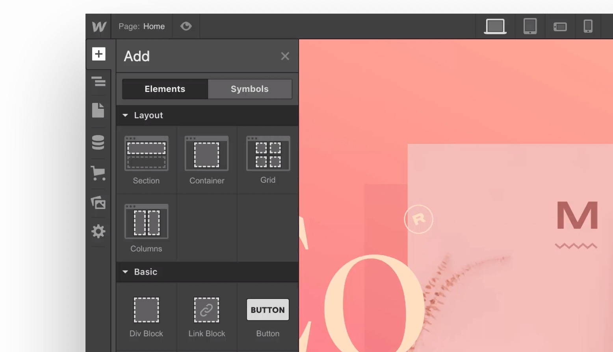

Webflow 的设计方式非常接近前端实现，比如你可以设置常见的布局方式：弹性布局、栅格布局等，还可以给元素添加 CSS 属性。

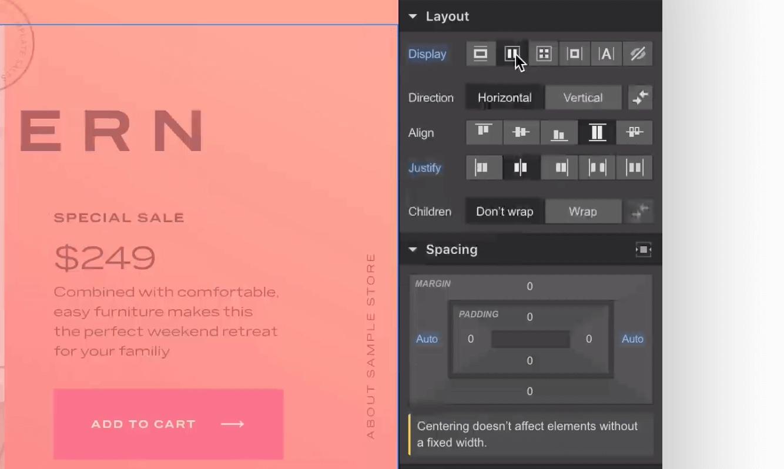

除此之外，它还提供了高级动效设置，以及内容管理系统，可以帮助你做出非常定制化的效果。**值得一提的是，Webflow 的[官网](https://webflow.com)也是使用 Webflow 做出来的。**

## Wix
[Wix](https://wix.com) 是国外一款比较流行的网站快速搭建工具。他们提供了丰富的模板，你只需要改改文字图片就可以发布上线了，也就是他们所谓的 ADI（人工设计智能）模式。当然，这只适合定制化不那么强的需求。

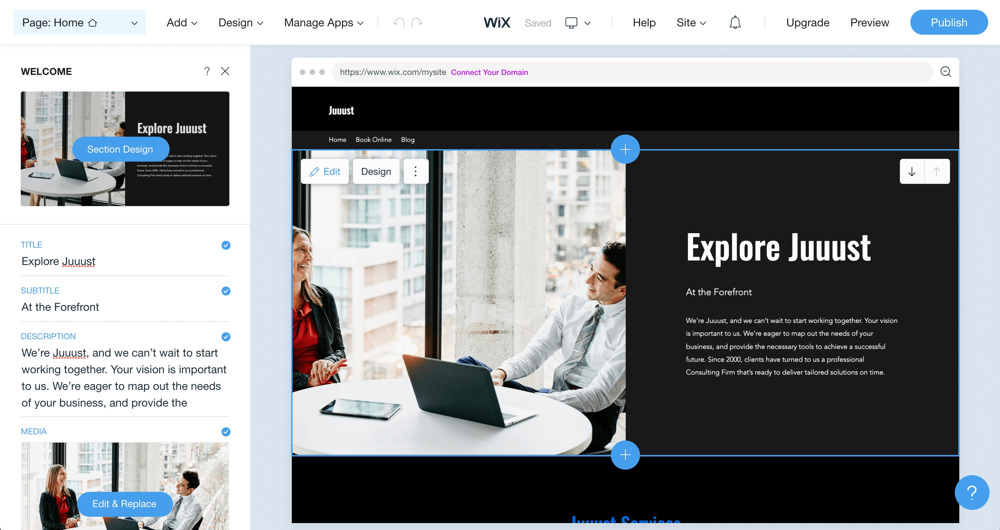

如果你的定制化需求比较强，可以试试他们的编辑器模式。在编辑器模式下，你可以更改元素位置，给元素添加动画，甚至还可以添加自定义代码。

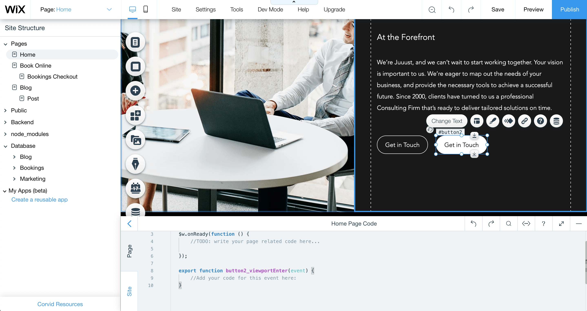

## Publii
[Publii](https://getpublii.com) 是一个非常适合设计师搭建个人网站的工具，它提供了很多漂亮的模板，你只需要在客户端中填写内容或编写文章就可以了。

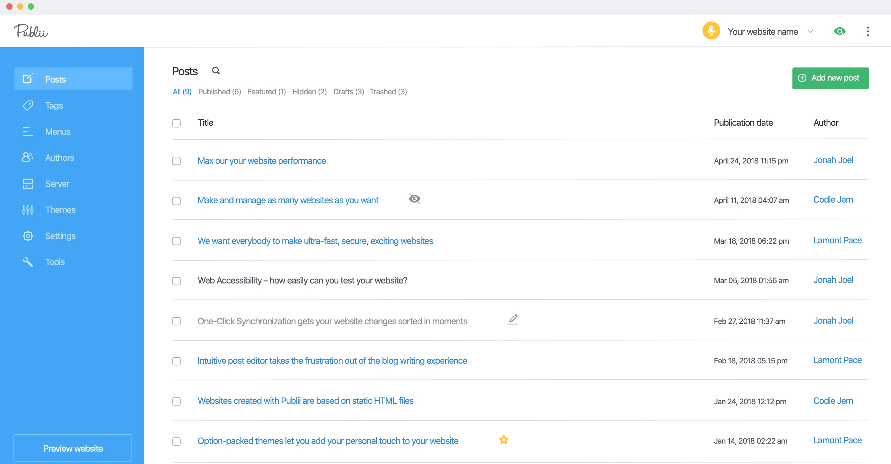

在 Publii 中编写文章，是用所见即所得的方式。你可以添加丰富的媒体资源，它会为你自动统计字数。

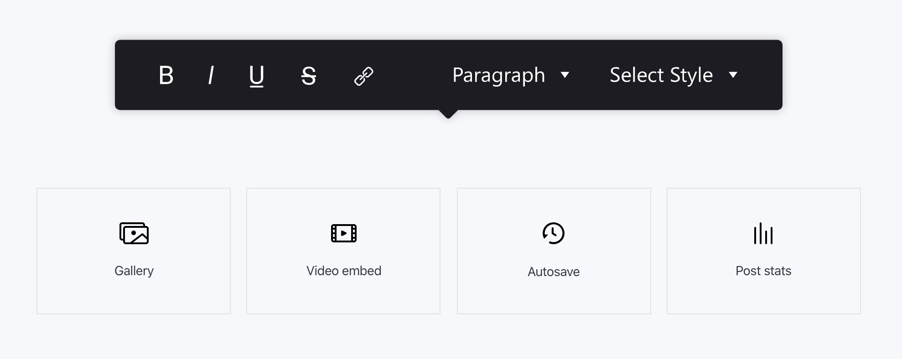

发布也很简单，你可以连接到自己的云服务器，或者选择 Github Pages 这种静态网站托管服务，就可以一键发布了。

## RapidWeaver
[RapidWeaver](https://www.realmacsoftware.com/rapidweaver) 采用设计师所熟悉的可视化操作方式来构建网站，它支持设备模拟、主题、插件等。你可以在左侧管理页面，或进行一些基本设置，在右侧修改内容。

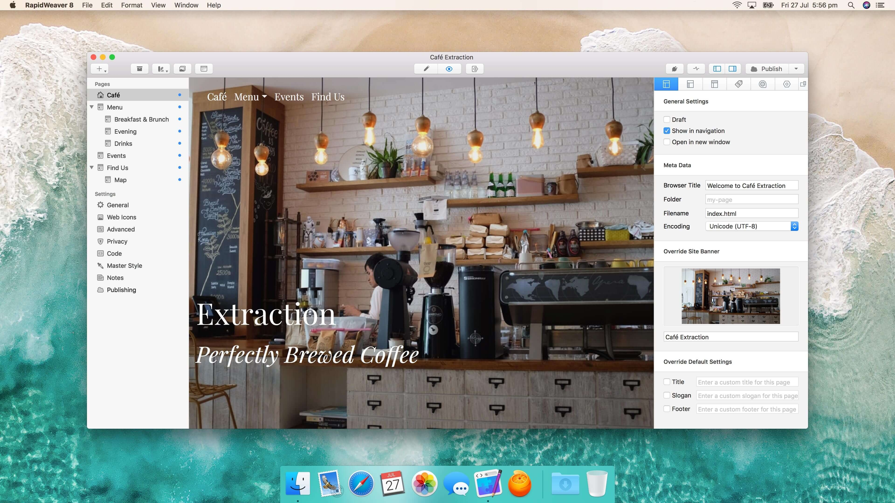

你还可以模拟不同尺寸的设备，来查看在不同尺寸下的显示效果。

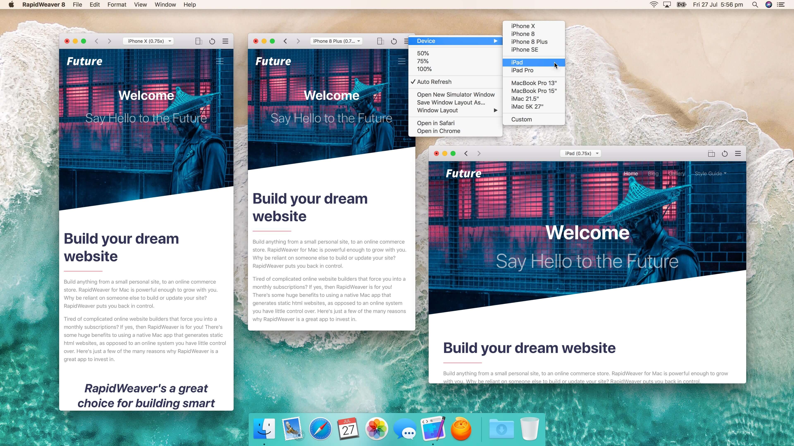

RapidWeaver 还支持插件，你可以通过插件给网站添加诸如社交按钮、购物车等定制元素。

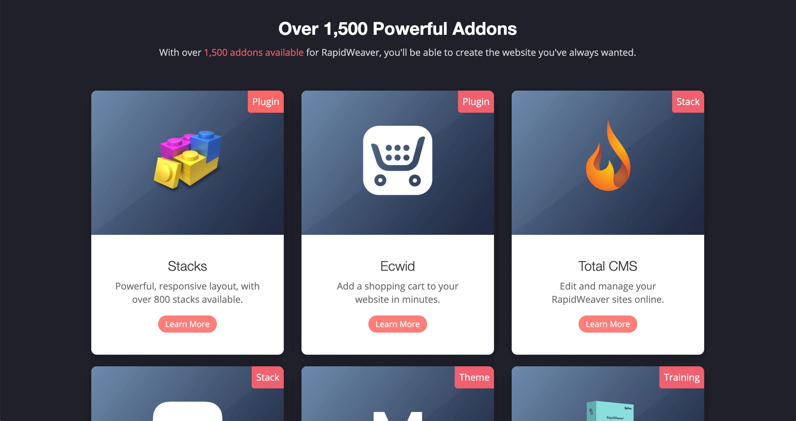

## Gridea
目前程序员使用最普遍的一个个人博客搭建方式是 Github Pages，这种方式不用你自己购买服务器，直接将代码传至 Github 就可以生成一个静态网站。但是，Github Pages 需要使用 Git，还是要理解一些技术，对设计师来说有点麻烦。而 [Gridea](https://gridea.dev/) 屏蔽了技术细节，让你只需要设置属性并编写文章，就可以一键发布至 Github 了。

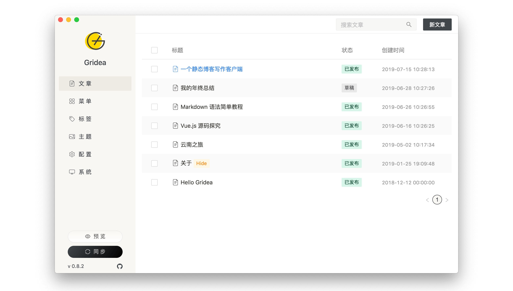

Gridea 支持 Markdown 写作、封面图设置、网站信息设置、多语言、多主题、评论系统接入，还支持 RSS 输出。

参考：[《Gridea 让你更方便地管理 Github Pages》](https://sspai.com/post/54212)。

## Github Pages
当然，如果你真的想了解一些技术，那么大可以去试试 Github Pages。Github Pages 有一个[介绍页面](https://pages.github.com)，会告诉你怎样通过仓库来搭建一个个人网站。

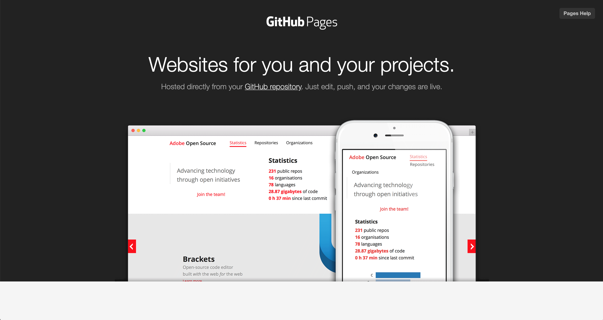

参考：[《GitHub Pages 搭建教程》](https://sspai.com/post/54608)

上面介绍的这些工具，基本是按照从易到难的顺序。其实，如果我们只是想搭建一个个人网站的话，大可不必去折腾服务器、数据库、命令行这些东西，不然很有可能把技能树点歪了。

对于设计师来说，使用一些可视化的设计工具，去搭建自己的个人网站是很好的选择，因为我们可以把注意力集中在内容上，这也应该是我们的个人网站最核心的东西。
