有一天我看到 [Figma](https://www.figma.com/) 的新首页时，突然产生一个想法——这个带有自己名字的鼠标指针看起来挺酷的，我能不能做一个 Figma 插件来生成这种光标呢？


我马上打开电脑，开始研究了起来。差不多花了一个多小时，我就把[这个插件](https://github.com/leadream/figma-plugin-cursor-creator)写了出来，它的效果就像下面这样。


现在我想要把这个过程分享出来，如果你也想写一个 Figma 插件说不定会有帮助。这个过程其实很简单，只需要三步：创建插件，编写插件，运行插件，就像把大象装进冰箱一样简单。

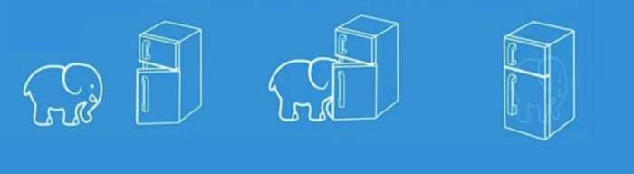

## 创建插件
在创建插件之前，我们需要先安装一点东西。首先我们需要安装 [VSCode](https://code.visualstudio.com/)，不然我们用啥写代码？其次，我们需要安装 [Node.js](https://nodejs.org/zh-cn/)，它可以帮我们将我们写的代码转换为 Figma 可读的插件代码。这两个东西你可以根据官网说明安装，此处不表。

接下来，我们还需要安装一个叫做 typescript 的东西，不过是要通过命令行安装，它的作用是帮助我们转换代码。打开你的终端（就是那个黑乎乎的东西，见下图），复制下面这行代码进去，按下回车，输入你的密码（输入时看不到变化），再次回车，过一会就安装好了。

```sh
sudo npm install -g typescript 
```

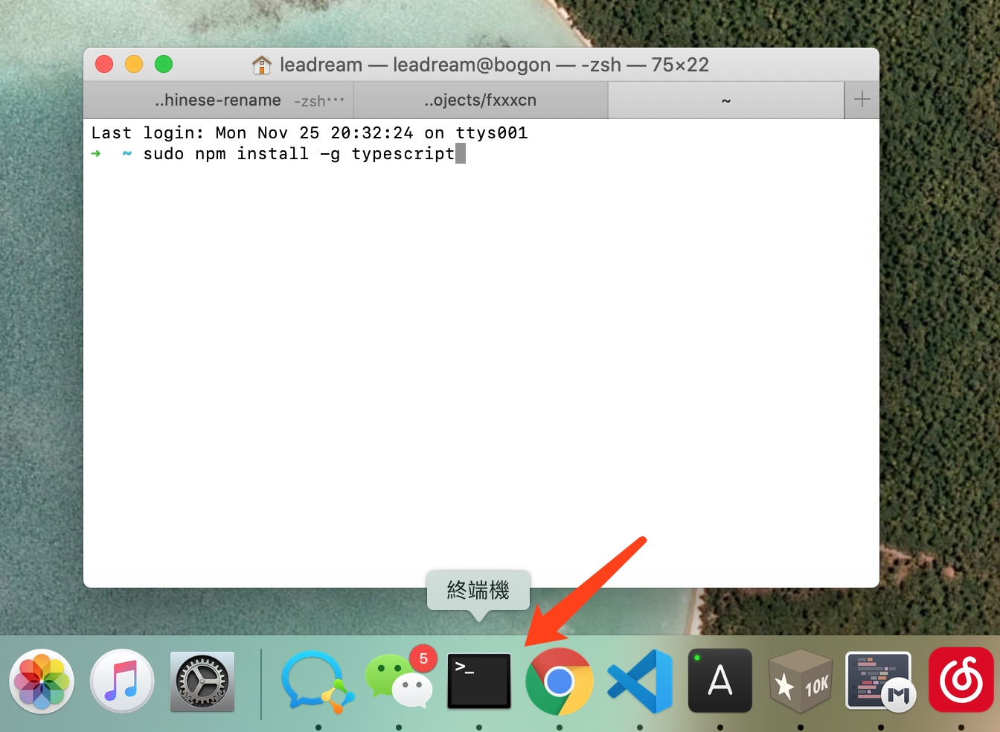

噢，别忘记了最重要的一项，安装 Figma 客户端，我们后续的插件测试都是在客户端中进行。好了，现在准备工作做好了，我们开始创建一个插件。

进入插件页面，点击右侧的 Development 右边的加号，就进入了创建插件的流程。

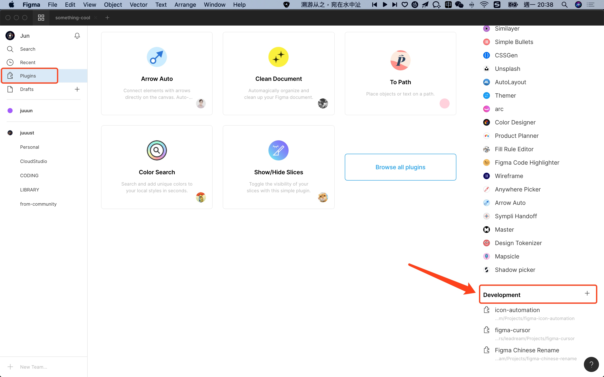

先填写一个插件名字，点击继续。

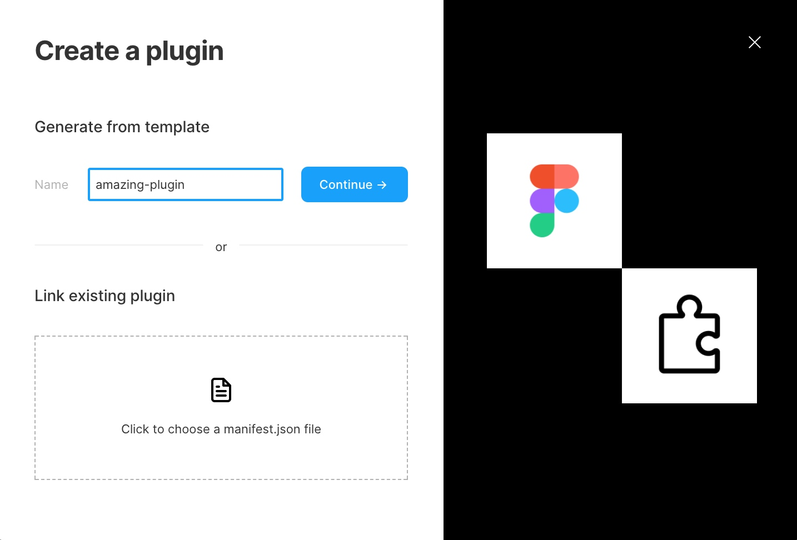

在这一步我们选择一个模板，因为我们的插件有界面，所以我们选择第三个模板。点击「Save as」按钮，把它存在本地一个文件夹中，这样第一阶段就算是完成了。

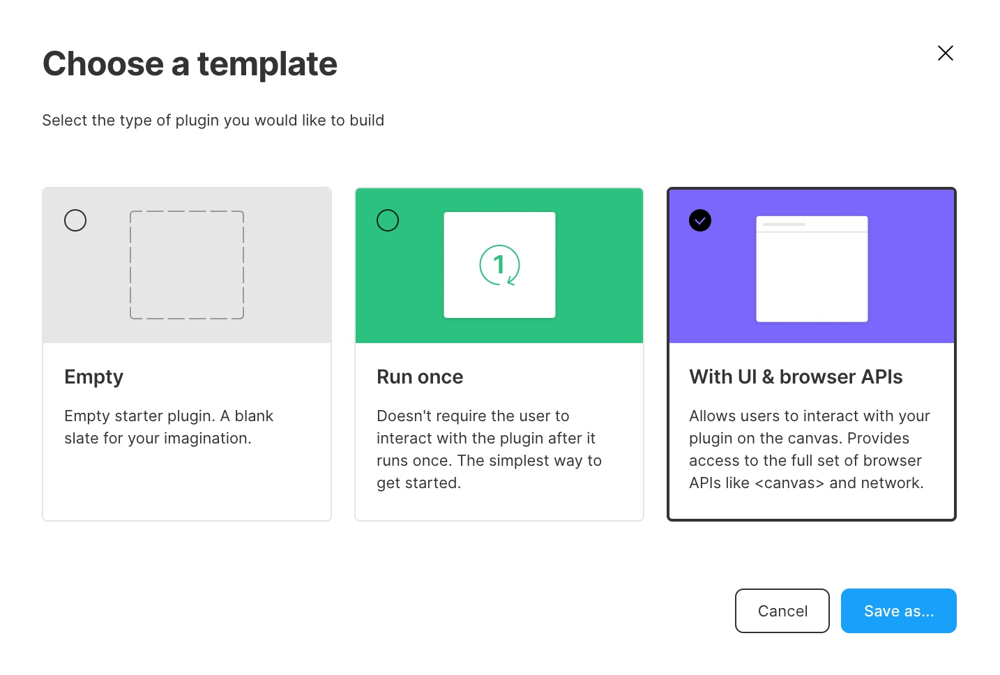

## 编写插件
现在我们开始进入正题——编写插件。首先打开你的 VSCode，选择文件，依次点击文件->打开，选择你刚才保存的插件文件夹。


我们主要编辑 `code.ts` 和 `ui.html` 这两个文件。

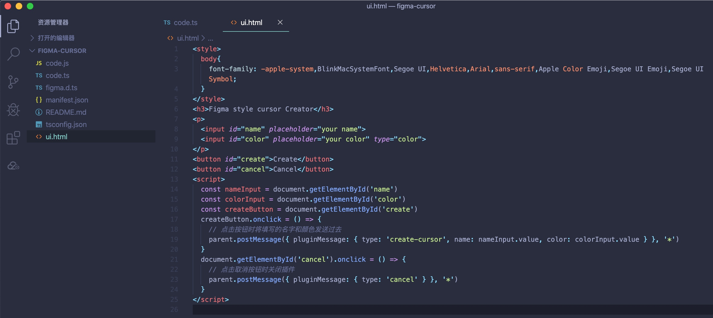

前面提到了，我们的代码需要被转换。按下 `Cmd Shift B`，会弹出两个选项，我们选择第一个「tsc:监视」，他可以在我们编写代码时转换代码。

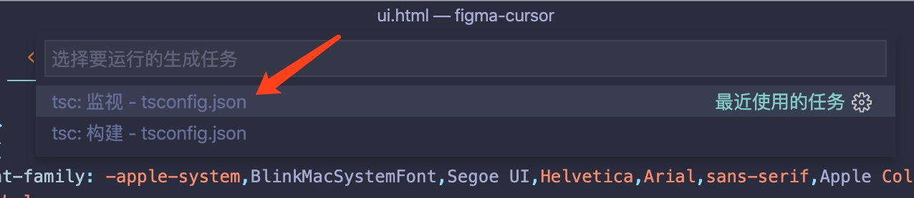

为了方便后面的讲述，我们先了解一下插件的运行原理。插件主要有两部分组成，一个是负责界面的，就是说你的插件需要一些界面和用户进行交互，这一部分不是必须的，因为有些插件不需要和用户交付。还有一部分是负责处理事务的，比如说在画布中画一个矩形。它们之间是通过传送消息来互相通信的。

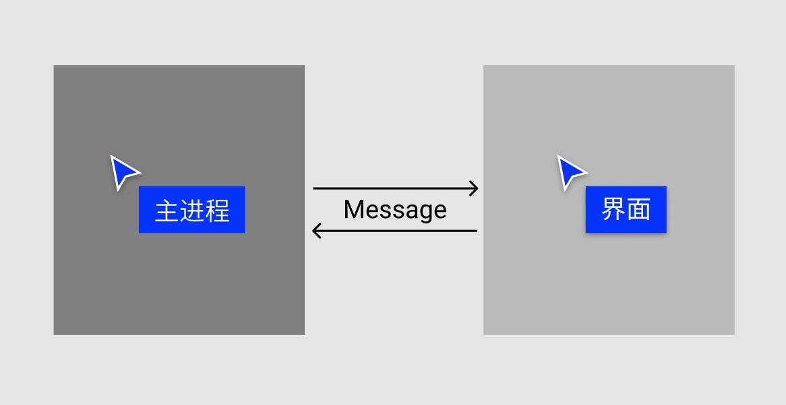

我们的插件是需要和用户交互的，所以我们需要先画一个界面。这个交互界面的代码在 `ui.html` 中，就是很常见的 HTML 代码。

```html
<style>
  body{
    font-family: -apple-system,BlinkMacSystemFont,Segoe UI,Helvetica,Arial,sans-serif,Apple Color Emoji,Segoe UI Emoji,Segoe UI Symbol;
  }
</style>
<h3>Figma style cursor Creator</h3>
<p>
  <input id="name" placeholder="your name">
  <input id="color" placeholder="your color" type="color">
</p>
<button id="create">Create</button>
<button id="cancel">Cancel</button>
```

它画出来的截面大概长这个样子：

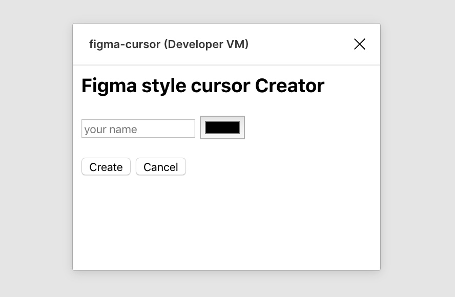

一个可以输入名字的输入框，一个颜色选择，两个按钮。有人说很丑，但是我们先不管这么多，又不是不能用。

界面画完了，但是这个绘制光标的事情需要再画布中完成，也就是说需要主进程来完成这个事情。所以我们需要获取到用户输入的名字和颜色，并将这两个值传给主进程。

我们在刚才的代码后面加上这一段代码，它的作用就是在用户点击按钮时将名字和颜色传给主进程。

```html
<script>
  const nameInput = document.getElementById('name')
  const colorInput = document.getElementById('color')
  const createButton = document.getElementById('create')
  createButton.onclick = () => {
    // 点击按钮时将填写的名字和颜色发送过去
    parent.postMessage({ pluginMessage: { type: 'create-cursor', name: nameInput.value, color: colorInput.value } }, '*')
  }
  document.getElementById('cancel').onclick = () => {
    // 点击取消按钮时关闭插件
    parent.postMessage({ pluginMessage: { type: 'cancel' } }, '*')
  }
</script>
```

接下来我们一起来写主进程也就是 `code.ts` 的代码。它的主要工作就是接收到消息后，在界面上绘制元素，基本结构如下：

```ts
// 整一个界面儿
figma.showUI(__html__)

figma.ui.onmessage = msg => {
  if (msg.type === 'create-cursor') {
    // 收到信号就开始比划
    // blablabla
  } else if (msg.type === 'cancel') {
    // 收到信号说要取消，关了
    figma.closePlugin()
  }
};
```

要绘制的元素有三个：一个名字，一个矩形底框和一个光标。

来跟我左边画一个名儿。名字就是一个文本图层，我们可以使用 `createText` 方法来创建，不过需要注意的是在绘制文本之前一定要先通过 `loadFontAsync` 加载好字体。

```js
// 来左边跟我一起画个名儿
const createName = async (nodes, name) => {
  // 画之前先要把字体加载好
  await figma.loadFontAsync({ family: "Roboto", style: "Regular" })
  const text = figma.createText()
  text.x = 24
  text.y = 21
  text.characters = name
  text.fills = [{type: 'SOLID', color: {r: 1, g: 1, b: 1}}]
  // 将文字添加到当前页面
  figma.currentPage.appendChild(text)
  nodes.push(text)
  return text
}
```

接着咱们在右边画一个矩形，画矩形使用的是 `createRectangle` 方法。

```js
// 在你右边画一个矩形
const createRect = (nodes, rgb) => {
  const rect = figma.createRectangle()
  rect.x = 17
  rect.y = 17
  rect.fills = [{type: 'SOLID', color: rgb}]
  figma.currentPage.appendChild(rect)
  nodes.push(rect)
  return rect
}
```

最后别忘了还需要画一个光标。光标就是一个 SVG 图像，只是要给它添加一个自定义底色，所以我们把它写成一个函数，通过参数把颜色传进去，这样调用这个函数就能得到一个自定义颜色的 SVG 字符串。

```js
// 画一个光标
const cursorCode = color => `
  <svg width="22" height="24" viewBox="0 0 22 24" fill="none" xmlns="http://www.w3.org/2000/svg">
    <g filter="url(#filter0_d)">
      <path d="M7.5 17L5 4L16 10.5L10.5 12L7.5 17Z" fill="${color}"/>
      <path d="M6.99999 17.1L7.25999 18.38L7.92999 17.26L10.83 12.43L16.13 10.98L17.27 10.68L16.25 10.07L5.24999 3.57001L4.29999 3.01001L4.49999 4.09001L6.99999 17.09V17.1Z" stroke="white" stroke-linecap="square"/>
    </g>
    <defs>
      <filter id="filter0_d" x="0.608521" y="0.0220032" width="20.9383" height="23.7218" filterUnits="userSpaceOnUse" color-interpolation-filters="sRGB">
        <feFlood flood-opacity="0" result="BackgroundImageFix"/>
        <feColorMatrix in="SourceAlpha" type="matrix" values="0 0 0 0 0 0 0 0 0 0 0 0 0 0 0 0 0 0 127 0"/>
        <feOffset dy="1"/>
        <feGaussianBlur stdDeviation="1.5"/>
        <feColorMatrix type="matrix" values="0 0 0 0 0 0 0 0 0 0 0 0 0 0 0 0 0 0 0.35 0"/>
        <feBlend mode="normal" in2="BackgroundImageFix" result="effect1_dropShadow"/>
        <feBlend mode="normal" in="SourceGraphic" in2="effect1_dropShadow" result="shape"/>
      </filter>
    </defs>
  </svg>
`
```

上面的函数只会生成一段 SVG 代码，我们还需要通过 `createNodeFromSvg` 方法把它画到画布之中。

```js
// 在中间比划一个光标
const createSVG = (nodes, color) => {
  const cursor = figma.createNodeFromSvg(cursorCode(color))
  cursor.x = 0
  cursor.y = 0
  figma.currentPage.appendChild(cursor)
  nodes.push(cursor)
  return cursor
}
```

这样，我们就准备好了所有绘制图形和文本的函数。现在我们需要逐个执行这些函数，来完成绘制工作。

绘制矩形时需要的颜色时 RGB 值，但是我们从用户输入那里获得的是 HEX 色值，所以需要一个转换函数来帮助我们转换一下。

```ts
// 齐活儿，开始整吧
const main = async msg => {
  const nodes: SceneNode[] = []
  // 将接收到的颜色转化为 RGB 格式
  const rgb = {r: hexToR(msg.color), g: hexToG(msg.color), b: hexToB(msg.color)}
  const name = msg.name
  // 画光标
  createSVG(nodes, msg.color)
  // 画矩形
  const rect = createRect(nodes, rgb)
  // 画名儿
  const text = await createName(nodes, name)
  // 根据名儿的宽度调整矩形宽度
  rect.resize(text.width + 14, 22)
  // 打包到一起
  figma.group(nodes, figma.currentPage)
  // 选中它们
  figma.currentPage.selection = nodes
  // 将视图滚动到它们的位置
  figma.viewport.scrollAndZoomIntoView(nodes)
}
```

最后，我们修改一下最前面的基本结构代码。

```js
// 整一个界面儿
figma.showUI(__html__)

figma.ui.onmessage = msg => {
  if (msg.type === 'create-cursor') {
    // 收到信号就开始比划
    main(msg)
      .then(() => {
        // 画完了，关了
        figma.closePlugin()
      })
  } else if (msg.type === 'cancel') {
    // 收到信号说要取消，关了
    figma.closePlugin()
  }
};
```

这样，我们就完成了整个插件的编写。

## 运行插件
想要运行插件很简单，我们在画布中右击，选择 Plugin->Development->你的插件名就可以了。

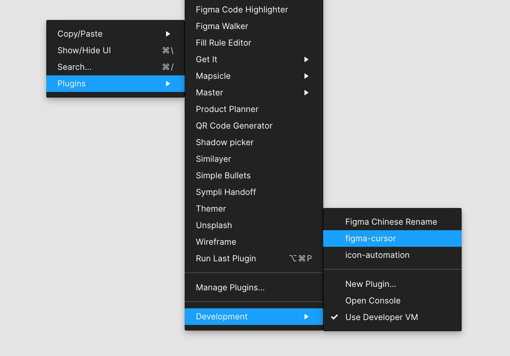

为了方便调试插件，你可以在通过上面方式调出过插件一次之后，按下快捷键 `Cmd Option P` 来再次调用插件。如果你想直接体验这个插件，可以直接去[这里](https://github.com/leadream/figma-plugin-cursor-creator)下载插件代码，并在创建插件之后选择从已有代码中选择 `manifest.json` 文件来使用。

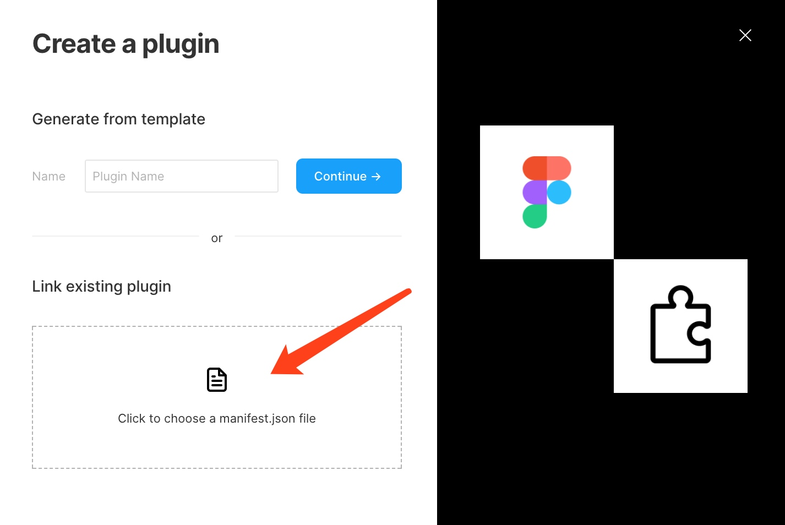

最后，我们下期见。

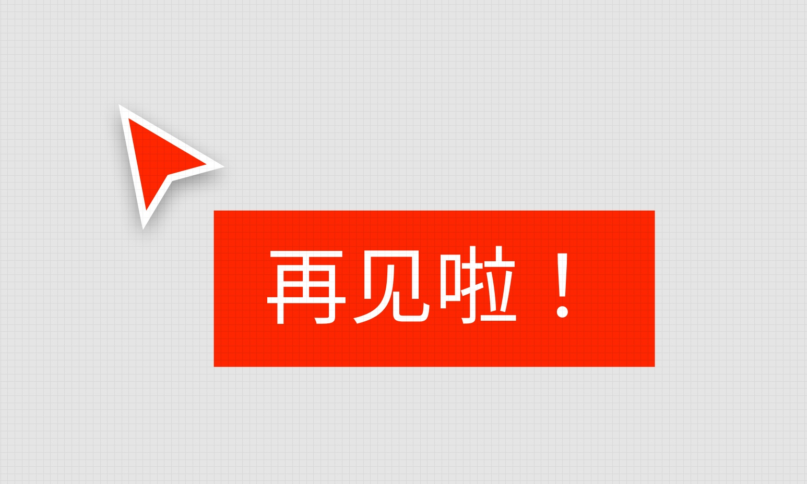
