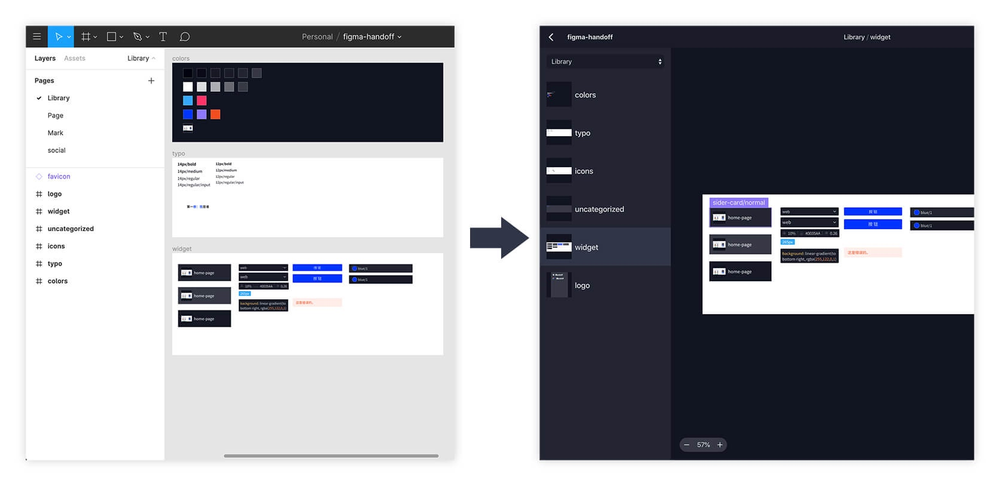

我做的 [Figma Handoff](https://mp.weixin.qq.com/s/6ygKUvGsmD5dkQqFEndRbA) 自发布已经快三个月了，为了不和官方的交付功能冲突，现在我决定将其更名为 Juuust Handoff（下文简称为 Handoff）。

在这段时间，我收到了[不少反馈](https://github.com/leadream/figma-handoff/issues)，针对这些反馈我不断迭代优化，包括开发了一个可以[更快导出标注的插件](https://mp.weixin.qq.com/s/-ELwsHjcxihoKkpjPqzNdQ)，让设计师和开发人员能够更好地协作。现在，我想针对这段时间很多人问到的一些问题统一解答，主要针对设计师和开发人员两个使用角度来说，希望可以帮助你更好地使用它。

## 设计师
### 像素密度和倍数
Handoff 支持在设置中选择平台像素密度，需要注意的是在平台为 Web 时选择的是「倍数」，平台为 iOS 和 Android 时选择的才是「像素密度」。

这是很多设计师都容易混淆的地方。这个故事说来话长，首先我们要明白手机或电脑的屏幕是用一个个微小的方块组成的，类似于像素画。早期受限于屏幕技术，一个物理方块代表设计图中的一个像素，后来随着屏幕技术的进步，为了获得更好的显示效果，苹果推出了搭载 Retina 屏幕的 iPhone 4，它使用四个物理方块来显示设计图中的一个像素。

这时候，其「像素密度」就是 @2x，设计图的尺寸也就需要变为 2 倍，比如之前使用 375 的宽度设计，现在则需要使用 750 的宽度。后来，随着屏幕技术进化，又出现了「像素密度」为 @3x，也就是九个物理方块来代表设计图中的一个像素。随着屏幕的种类越来越多，设计师就需要为不同「像素密度」的设备分别设计一套图，这得多累啊。

所以，后来 iOS 和 Android 分别有了 pt 和 dp 的虚拟单位，在你的设计中 10×10px 宽的元素在代码中被写为 10pt 或 10dp，而设备会自动根据屏幕的像素密度来解析，比如在 @2x 屏幕上用 20×20 个物理方框来显示它。

所以，这里的设置其实是为了解决历史遗留问题，如果你有一些设计图还是二倍图或三倍图，就可以用这个把它转化为 pt/dp 所需要的数值。所以这里当你选择了 @2x 它会把你的设计尺寸除以 2。**不过现在都 2020 年了，建议大家都使用一倍图做设计**。

对于 Web，你写的单位 px 会被浏览器自动解析为对应的物理方块尺寸大小，它是屏幕像素密度无关的。在设置这里设置的也是「倍数」，也就是和 iOS、Android 反过来，选择了 2x 时会把你的设计尺寸乘以 2。这个其实没什么用，也就是在写小程序转换为 rpx 时有点用，不过有很多库可以把 px 转为 rpx 单位，比如 [px2rpx](https://www.npmjs.com/package/px2rpx)，所以也建议你使用一倍图做设计。

希望这个设置在以后可以被丢弃进历史长河中，更多细节可以查看[像素密度解密](https://intersection.tw/像素密度解密-630b3ac2e0bb)，以及[这个视频](https://vimeo.com/169809377)。

### 切图设置
切图这件事，我建议还是设计师自己来。在 Figma 右侧面板中有一个 Export 属性，你可以在那里添加 Export，每一个都会被 Handoff 识别到并按照你的设置导出。比如，按照下图中的设置会导出 `thumb-up-ios@3x.png` 和 `thumb-up.svg`（该图标命名为 thumb-up）。

如果你想要快速给元素添加多个导出设置，比如 iOS 的 @1x/@2x/@3x/@4x，可以使用一些插件批量添加，比如这个 [Figgy exporter](https://www.figma.com/community/plugin/778302475291888898/Figgy-exporter)。

需要注意的是，Handoff 不会识别 Slice，Slice 可能是 Figma 为了兼容 Sketch 用户而做的，不太好用，所以还是建议使用 Export。

对于设计师特别烦的开发查看标注时总是会点到切图内部的问题，最近的一个更新可以设置不允许点到切图内部，在后文开发人员部分会详细说。

### clip content
Figma 的 Frame 有一个选项「clip content」，勾选之后可以隐藏超出的部分。这个选项常常会引起 Handoff 标注的错位，原因在于 Handoff 识别的是 Frame 自身的尺寸，但导出的图片是包含超出部分的，这样尺寸就对不上了。因此，我建议在设计时最外层 Frame 都勾选该选项，这样就不会错位了。

如下图，尽量不要出现左边这样内容超出 Frame 的现象，而右图最外层 Frame 本身带有投影什么的则没有关系。

### 样式及组件
Handoff 会自动识别本文件中所有的样式，显示在右侧，而组件可以在导出时选择是否导出组件列表。如果选择导出，就会生成一个组件列表在左侧。我建议在设计时把样式和组件单独放在某一个 page 内，这样就不需要单独导出组件列表了。

目前，Handoff 还只能识别到当前文件内的样式和组件，如果你的样式和组件在单独的文件内，则需要单独将这个文件导出，目前还没有办法关联。

### 其它
Handoff 目前只会识别到第一层 Frame，也就是直接处于画布中的 Frame，因此在设计时请保持 Frame 都是直接处于画布中。

还有一个需要注意的，那就是有些设计师的元素只是看起来在 Frame 内部，实际上不在里面，这样识别出来的页面就是空白的。比如下图中，那些元素只是看起来在 home 这个 Frame 里面，实际上和它是同级的，需要拖拽到它的子级中。

## 开发人员
### 画布操作及快捷键
Handoff 的操作主要集中于查看标注的画布中，目前支持的操作和快捷键如下：
- 两指捏放或滚动鼠标滚轮进行缩放
- 按住鼠标中键或空格键可以拖拽画布
- 按 Cmd +/- （Windows 下 Ctrl）放大缩小
- 按 ESC 可取消选择元素

### 切图相关
Handoff 右侧面板中会显示所有切图，你可以单个下载也可以打包下载。如果查看的标注是本地文件，也就是直接双击 index.html 文件打开时，点击切图不是下载而是查看文件，你可以在解压后的文件夹内 data/exports 里面看到所有切图。如果你[使用一些工具将标注文件开启为静态网页服务](https://mp.weixin.qq.com/s/_IIVnhJiMUAWhnRBfhoh5A)，切图这里仍然是可以下载的。

当你在查看某一个页面的标注时，可以选中最外层，这时候在右侧会显示当前所有的切图。需要注意的是，设计师最好不要在最下面放一个同样大小的背景矩形，否则你选择到的就不是最外层，而是这个背景。

在设置中，有一个「不允许选中切图（Export）内部图层」的选项。一般切图会作为一个整体，写代码的时候也需要写它的最外部尺寸，但有时候容易点到内部元素，导致查看到的尺寸不对。这时候我们就可以勾选这个选项，这样看到的尺寸就是切图外层的尺寸。

需要注意的是，当你更改这个选项之后还看不到效果，需要在左边切换一下 Frame 才可以生效。

### 多样式文本
多样式文本在产品设计中很常见，比如一段文字里面有一个链接，链接的颜色和其他文字不一样。在 Handoff 中我设计了一种比较方便的方式来查看多样式文本，右侧文本框内的文字会被自动分段，点击对应的片段就可以获取分段文字的样式，而双击文字片段会复制这个片段的文字。

以上就是我对于 Juuust Handoff 的使用说明，如果你有任何使用问题可以在下面留言，反馈 bug 或需求可以前往 [GitHub issues](https://github.com/leadream/figma-handoff/issues) 提新的 issue。

## 一些链接：
- 介绍页面：https://figmacn.com/handoff-landing
- 插件：https://www.figma.com/community/plugin/830051293378016221/Juuust-Handoff
- 在线版：https://figmacn.com/handoff/
