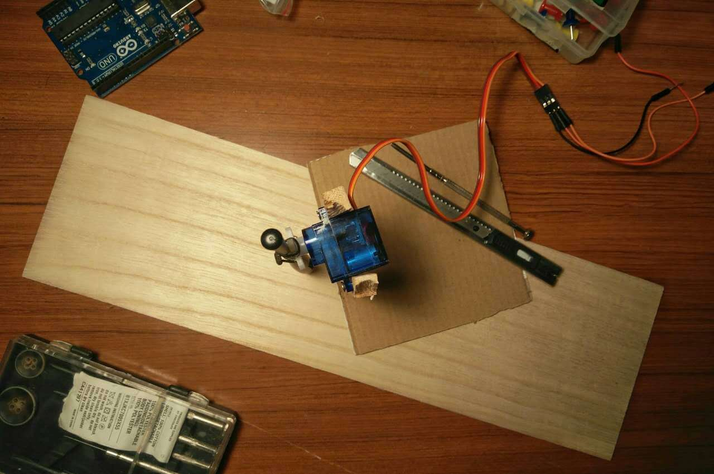
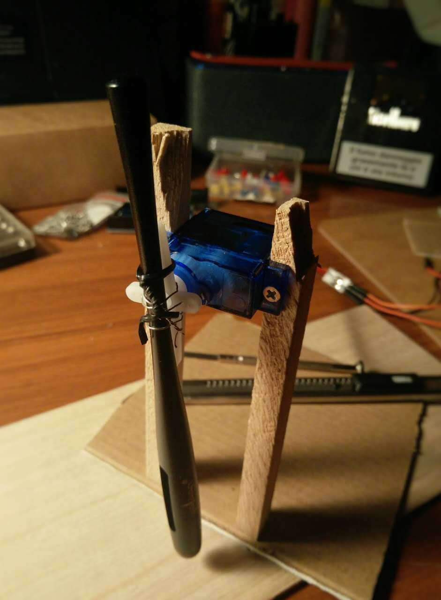

前一段时间我机不离手，几乎都是在刷朋友圈。坐车刷拉屎刷睡觉刷吃饭刷，即使在不刷的时候也还是在回味朋友圈的内容，或者想着怎样回复才能在众多回复中脱颖而出。这严重地影响了我的生活，让我无法安心地干一件事。我想让刷朋友圈的效率更高，让我有更多时间做该做的事，我不想老了之后回忆起二十多岁干了什么却发现朋友圈占据了绝大多数时间。

之后几天我一直在想这个事情，想着怎样能够更高效的刷朋友圈。有一天我用触控笔在iPad上画画的时候，一个想法突然冒了出来。这个想法在我脑中逐渐清晰，我根据自己的想像画了一张草图，描述了它的工作方式：

有一个旋转的电机带动触控笔在屏幕上来回扫动，这样就可以代替我刷朋友圈啦。但是有一个问题：往上刷没问题，但当触控笔回来时又会把朋友圈刷回来。苦思冥想后我找到了一个办法完美地解决了这个问题：在触控笔刷完之后迅速地提起笔来，让它往回刷时接触不到手机屏幕；当它回到起点再放下去，又可以接触到屏幕了。

我怕这个想法溜走，就赶紧网购了木棒、螺丝、铁片等工具，立即开始制作。

这是第一部分，暂且称它为笔刷吧。因为主打实用，我就不在意它的美观了。所以你可以看到我用铁丝捆绑固定的触控笔和削得不是很整齐的木棒。

我把做好的笔刷固定在瓦楞纸上，再把瓦楞纸固定在木板上。在瓦楞纸折痕那里可以上下摆动，就能控制触控笔这一端离开和接触木板。在木板的右侧固定了一个电机，它的转轴上有一个铁片，来回转动时就可以把瓦楞纸撑起来或放下去。

把这两个电机按照既定的接口和Arduino连接好，连上电脑，把写好的程序下载进去，让它们按计算好的角度来回摆动，这个小设备就运作起来了。最后，我把微信打开翻到朋友圈那一页，放在笔刷下面。随着笔刷来回起伏摆动，朋友圈就不断地往上滚动，相比于手刷要快很多。

今天一早起来我就把手机放在上面开始刷，下班的时候我拿起手机，发现已经刷到2012年了。果然神速！这一天我工作特别专注，吃饭也吃得更香。晚上睡觉时回想起这一天，我觉得特别充实。
