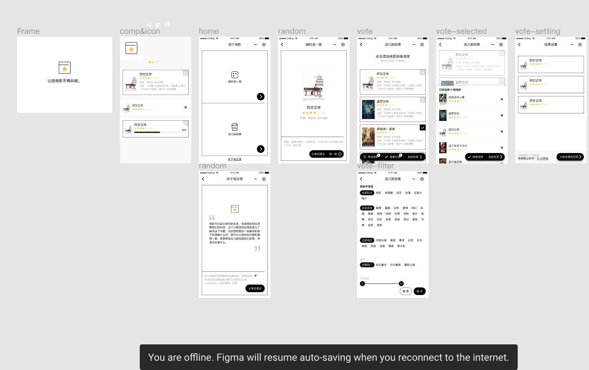

最近迷上了 Figma——一款基于浏览器的在线协作工具。Figma 很多细节做的很棒，用一个朋友的话说，是很懂设计的人为设计师贴心打造的。为了方便更多国内设计师了解并使用这款设计软件，我自己设计并开发了 [Figmacn.com](https://figmacn.com)。

目前，就我自己的使用体验来看，Figma 有以下特点吸引了我。

## 完全云端协作
最开始一直担心 Web 端的性能跟不上，没有原生应用那么顺滑。直到我使用了 Figma 才发现，这种担心完全是多余的。Figma 已经被打磨地很顺滑，而且会在网络条件不好时自动将改动保存在本地。

当性能不再成为瓶颈，云端应用的优点就显现出来了。首先是跨平台，**不需要下载安装，不限操作系统，只需要在浏览器输入链接就能进入自己的工作区**。其次，所有文件存在云端，不用费神管理一堆本地文件了。最后，Web 端便与传播的特性使得交付变得简单，**只需要将链接给其他人，查看标注、实时评论都很方便**。

## 更加符合直觉的组件
Sketch 的 Symbol 我一直觉得有几个地方不合理，首先是只能通过 Symbol Overrides 来改变样式，这意味着你要不断给 Symbol 增加可能的状态。如果只有一个 Symbol 的实例需要做一些不同的样式，就只能将这个 Symbol 拆卸（Detach）了。而 Figma 则完全不同，组件实例有一些属性是不能改变的，但有一部分属性是可以改变的。这意味着，你可以保持各个组件实例能够和 master 保持一致的同时，又能够对其中某个实例做一些变动，通过下图感受一下。

还有一点是 Sketch 的 Symbol 必须要进入 Symbol 编辑模式才可以编辑，而 Figma 的组件可以放在页面的任何地方。这样就很方便，因为我可能要随时根据当前设计来更改组件。

## 其他小细节
还有其他的一些小细节，比如文字的颜色没有单独拿出来，而是使用填充色来调整。这样是很方便的，因为我经常需要同时更改一个图层和文字的颜色。在其它设计软件中就只能分开更改文字颜色和图层颜色了。

诸如此类的细节还有很多，这让我对 Figma 好感倍增。目前，我已经使用 Figma 作为自己的主力设计工具，如果你想更深入地了解 Figma，可以前往 [Figmacn.com](https://figmacn.com)。

### 参考
- [如何使用 Figma 来完成你的设计工作流](https://mp.weixin.qq.com/s/6lPT_9NQmqwVYOlaL0NkEw)
- [Figma 最佳实践：组件、样式和共享库（上）](https://mp.weixin.qq.com/s/PoEk5vRRrquLOTOH3QZgIw)
- [在 Figma 中如何选择 group（组）或 frame（画框）？](https://mp.weixin.qq.com/s/FsuuJBXr3es9D2Yg-NZP9g)
- [使用 Figma 完成产品设计工作流](https://mp.weixin.qq.com/s/dvgyO_lh7XvjjoImo1hIxw)