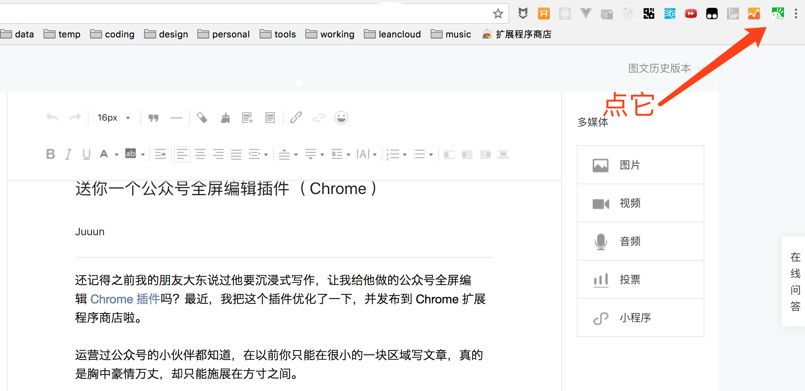

运营过公众号的小伙伴都知道，在公众号后台，你只能在很小的一块区域写文章，真的是胸中豪情万丈，却只能施展在方寸之间。

你能编辑的区域只有上面图中红框内这么大，旁边那么多都是信息噪音。遇到这种问题怎么办呢？有钱的话可以换个超大显示器，没钱就只能自己解决了，我属于后者。于是乎，我就写了一个 Chrome 插件，让微信编辑器支持全屏写作。

实际效果就和上图一样，把无关的信息都隐藏起来，让写作者专注于内容。终于清静了，现在文思如泉涌，谁与我争锋？

### 如何使用

安装之后，在浏览器右上角就会出现一个插件的图标。进入公众号后台文章编辑页面，点击这个图标，就会进入全屏模式，再次点击就会退出全屏。

### 参考
- [产品经理朋友说要沉浸式写作，我给他写了个Chrome插件](https://mp.weixin.qq.com/s/dzWhbGRn5lBexy8k1E7uDA)
- [送你一个公众号全屏编辑插件（ Chrome ）](https://mp.weixin.qq.com/s/rXfQgMioNTW6OHPpbnMEgQ)
- [如何获得更加沉浸式的公众号写作体验？](https://mp.weixin.qq.com/s/n87JszPfBA3Y7tXbOzmZ_g)